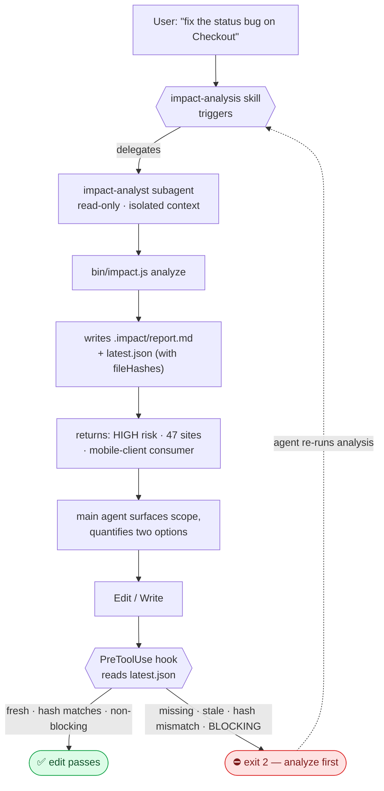
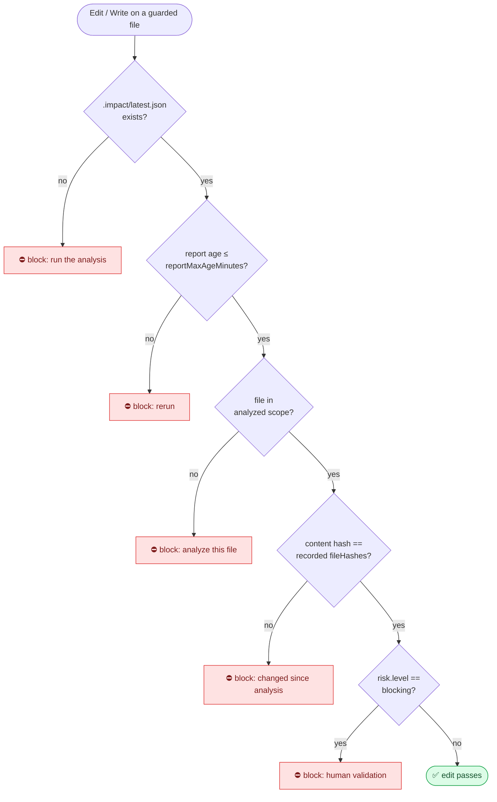
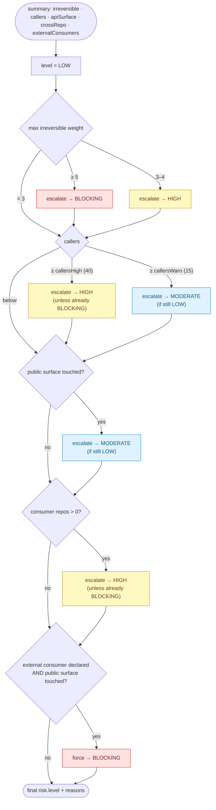

# seismo-cc — Claude Code plugin v0.1

Impact analysis before modification. The plugin provides the following components that work together:

| Component | Role |
|---|---|
| `agents/impact-analyst.md` | **read-only subagent** — runs the analysis in its own context and returns ~15 lines |
| `skills/impact-analysis/` | teaches the main agent **when** to delegate and **what to do** with the verdict |
| `commands/*.md` | five slash commands for manual invocation — `/seismo-cc:impact` (full scope), `/seismo-cc:tests` (affected tests only), `/seismo-cc:api-diff` (breaking public-surface changes only), `/seismo-cc:brief` (business impact brief, reuse-vs-net-new, no code), `/seismo-cc:scope` (scope a not-yet-built feature from a spec) |
| `hooks/hooks.json` | **`PreToolUse` guard** — by default **advisory** (warns when no fresh report covers an `Edit`/`Write`, but lets it through); set `"gate": "blocking"` to enforce |
| `lib/analyze.js` | **the engine** — `run(opts)` computes the impact `data` with **no side effects**; `persist(root, data)` writes the report. One code path, shared by every transport |
| `bin/impact.js` | the **CLI transport** — a thin, zero-dependency Node wrapper that calls `run()` then `persist()` and formats stdout (`--json` / `--short` / md) |
| `src/mcp-servers/seismo-impact/` | the **MCP transport** — a zero-dependency stdio JSON-RPC server over the *same* engine (see [MCP server](#mcp-server--seismo-impact)) |

The engine is deliberately dependency-free, index-free and server-free: it must drop into any of the ~100 repos with no build, no NuGet, no service to host.

> 📚 **In-depth documentation** lives in [`docs/`](docs/README.md): architecture, the scientific concepts, the formal model with equations, algorithms and complexity, the analysis pipeline, the risk model, the historical-coupling engine, the configuration reference, and an honest account of the limitations.

**One engine, two transports.** The analysis logic lives in `lib/analyze.js` — `run(opts)` returns the impact `data` and writes nothing; `persist(root, data)` materialises `.impact/report.md` + `.impact/latest.json`. The CLI and the MCP server are two thin transports over this single engine: one computation path, one artifact. That is what guarantees the `PreToolUse` gate always sees the report the analysis just wrote, whatever the source.

**Support per stack:**

| Stack | Symbol resolution | Detail |
|---|---|---|
| **C#/.NET** | first-class | declarations (types, including `private` methods, properties including expression-bodied), namespaces to detect homonyms, verbatim/interpolated strings ignored, EF migrations, ASP.NET/FastEndpoints/Minimal API endpoints |
| PHP/Laravel, Kotlin, TypeScript | best-effort | declarations and references by name, less precise than .NET |
| any language | git coupling | co-change only reads git, so it works everywhere |

In other words: **the target and best-covered stack is .NET**. The other stacks are supported but with more false positives/negatives on name-based resolution. Historical coupling, on the other hand, is language-agnostic.

**Improved non-.NET resolution.** For PHP/Kotlin/TypeScript the reference search is no longer a bare name grep. It builds a small **import graph** and matches on **qualified references**:

- it parses `use` / `import` statements and compares the **full import path** to disambiguate cross-module homonyms — `use App\A\Order` vs `use App\B\Order` both import an `Order`, but only one points at the declaration you are analyzing;
- it excludes PHP `$variables` and JS `$identifiers` from name matches via a `(?<![\w$])` lookbehind, which a plain `\b` matched by mistake;
- it tags each caller with a **`confidence`** (`high` / `normal` / `low`): a file that imports the exact declaration, lives in the same module, or has a qualified call site (`->`, `::`, `.`, `new`) is `high`; a file that imports a same-named symbol from *another* module is `low`.

This is **additive** — the raw call-site counts feeding the risk score are unchanged, so there is no regression on the calibrated .NET path — but it narrows the false positives the best-effort stacks are otherwise prone to.

## The loop



The hook is what makes the difference between an agent that is *advised* and an agent that is *prevented*. Without it, the skill is a suggestion the agent ignores the moment it is in a hurry.

The subagent cannot write (`disallowedTools`), so the guard never triggers against it — no loop.

## Commands and surfaces

Five slash commands cover manual invocation over the same engine; all delegate to the read-only `impact-analyst` subagent (the first three are scoped developer views; the last two are decision/planning views that assume the code may be written by an agent, so they size work by reuse-vs-net-new, not developer-hours):

- `/seismo-cc:impact [symbol|file|--diff]` — the **full impact scope**: risk, callers, historical coupling, public surface, irreversible ops, affected tests.
- `/seismo-cc:tests [symbol|file|--diff]` — **only the affected tests**, each labelled `structural` (references the symbol) or `historical` (git co-change), plus the command to run them.
- `/seismo-cc:api-diff [--base <ref>]` — **only the breaking public-surface changes** vs a base (removed / changed endpoints, DTOs, hubs; additions excluded; base defaults to `origin/main`).
- `/seismo-cc:brief [symbol|file|--diff|<spec>]` — a **business impact brief for analysts / PMs / leads**: reuse-vs-net-new, a complexity estimate, downstream teams, risk, and **the decisions a human must make** — plain language, **no code**. Handles a change *or* a not-yet-built spec (empty diff ⇒ sized by building blocks, not a misleading "small").
- `/seismo-cc:scope [<spec>|symbols]` — **scope a not-yet-built feature from a spec**: maps each concept to a **reusable anchor** found in the code or a **net-new** piece to build, with complexity and the decisions that block the work. For the implementer (agent or dev) and the tech lead.

When each surface is used:

| Surface | Triggered when | Invoked by |
|---|---|---|
| Skill `impact-analysis` | a task touches existing code, or the user asks "what's the impact / what does this break / is it risky", or before opening a PR | automatically (description match) |
| Subagent `impact-analyst` | the skill or a slash command decides to delegate | launched via the Task tool |
| `/seismo-cc:impact [symbol\|file\|--diff]` | manual request for the full impact scope | the user |
| `/seismo-cc:tests [symbol\|file\|--diff]` | manual request for only the affected tests | the user |
| `/seismo-cc:api-diff [--base <ref>]` | manual request for only breaking public-surface changes vs a base | the user |
| `/seismo-cc:brief [symbol\|file\|--diff\|<spec>]` | manual request for a business impact brief (analyst / PM / lead; reuse-vs-net-new, decisions; no code) | the user |
| `/seismo-cc:scope [<spec>]` | manual request to scope a not-yet-built feature (reusable anchors vs net-new, blocking decisions) | the user |
| PreToolUse hook (gate) | every `Edit`/`Write`/`MultiEdit` on a guarded file | automatically (blocks if no fresh covering report) |
| MCP `get_blast_radius` | the agent needs the full scope and to persist coverage for the gate | the agent (only MCP tool that writes the report) |
| MCP `get_affected_tests` / `get_public_api_diff` / `get_irreversible_ops` | the agent needs a scoped, advisory answer without persisting | the agent |
| CLI `analyze` / `gate` / `record` | outside Claude Code — terminal, CI, git hook | user / CI |

## Installation

> Every install method (Claude Code marketplace, local plugin dir, another catalog, standalone CLI, MCP server, per-repo config) is documented in full in **[INSTALL.md](INSTALL.md)**. The essentials:

### From the marketplace (recommended)

The repository **is** a Claude Code marketplace (`.claude-plugin/marketplace.json` at the root). Inside Claude Code:

```
/plugin marketplace add MulhamAryan/seismo-cc
/plugin install seismo-cc@seismo-cc
```

`seismo-cc@seismo-cc` reads as `<plugin>@<marketplace>` — both are named `seismo-cc`. Once installed, everything activates on its own: the `impact-analysis` skill, the `impact-analyst` subagent, the five slash commands (`/seismo-cc:impact`, `/seismo-cc:tests`, `/seismo-cc:api-diff`, `/seismo-cc:brief`, `/seismo-cc:scope`), the `seismo-impact` MCP server, and the `PreToolUse` guard. Nothing else to wire.

### From GitHub (clone)

```bash
git clone https://github.com/MulhamAryan/seismo-cc.git
claude --plugin-dir ./seismo-cc
```

### Local test

```bash
claude --plugin-dir ./seismo-cc
/reload-plugins        # after modifying a component other than a SKILL.md
```

### As an entry in another catalog

To publish it inside a *different* marketplace repo instead, `examples/marketplace.json` is the catalog template — add an entry whose `source` points at this repo.

### Per repo

```bash
echo ".impact/" >> .gitignore
cp <plugin>/impact.config.example.json impact.config.json   # optional, recommended
```

Node 18+. No `npm install`.

## Testing

```bash
./test/smoke.sh                              # engine + guard assertions
./test/fixture.sh /tmp/fixture               # standalone synthetic multi-stack repo
node test/calibrate.js ~/repos --commits 60  # risk-level trigger rate on real history
node test/validate.js ~/repos/my-service     # precision/recall of the coupling predictor
```

Full four-phase protocol, including the manual Claude Code part: `test/README.md`.

Calibration is the phase that decides deployment. Do not push anything to the marketplace before running it on three representative repos. `validate.js` is the empirical precision/recall of the co-change signal — a leakage-free, transaction-based measurement that also sweeps the coupling thresholds so you can tune them per repo (see [`docs/07`](docs/07-git-historical-coupling.md#11-validation) and [`docs/ROADMAP.md`](docs/ROADMAP.md)).

## What it answers

| Question | Mechanism | Confidence |
|---|---|---|
| Who calls this symbol? | name search, comments and literals stripped | textual |
| What *always* changes with this file? | co-change over git history | deterministic |
| What breaks outside the repo? | endpoints, DTOs, hubs, declared consumers, sibling-repo scan | structural |
| What won't a sandbox catch? | destructive migrations, raw SQL, emails, jobs, payments, auth | structural |
| Which tests to run first? | reference to the symbol + historical coupling | mixed |

Historical coupling is the heart of the tool. It is what catches what static analysis cannot see: config in the database, hardcoded SQL, reflection, convention-based DI, docs to update. It is deterministic and free.

## Direct use of the engine

```bash
node bin/impact.js analyze --symbols Checkout,OrderService --short
node bin/impact.js analyze --files src/Domain/Checkout.cs
node bin/impact.js analyze --diff --base origin/main
node bin/impact.js analyze --symbols Checkout --workspace ~/repos   # cross-repo
node bin/impact.js gate --file src/Domain/Checkout.cs               # used by the hook
```

Outputs: `.impact/report.md` (readable, for the agent and the reviewer) and `.impact/latest.json` (machine).

Options: `--root <dir>` `--workspace <dir>` `--json` `--short`

## MCP server — `seismo-impact`

The second transport over the engine. `src/mcp-servers/seismo-impact/index.js` is a **zero-dependency stdio JSON-RPC 2.0** server, declared in `.claude-plugin/plugin.json` under `mcpServers`:

```json
"mcpServers": {
  "seismo-impact": {
    "command": "node",
    "args": ["${CLAUDE_PLUGIN_ROOT}/src/mcp-servers/seismo-impact/index.js"]
  }
}
```

It wraps the **same** `lib/analyze.js` the CLI uses. Only **`get_blast_radius`** — the tool that establishes the scope *before* an edit — runs `persist()` and writes `.impact/latest.json`, feeding the `PreToolUse` gate. The other three (`get_affected_tests`, `get_public_api_diff`, `get_irreversible_ops`) are **advisory queries**: they compute and return **without** overwriting the coverage, so a narrow-scope query can never erase the perimeter `get_blast_radius` just established (which would otherwise make the gate block an already-analysed file). The MCP layer is advisory / queryable; the deterministic `PreToolUse` hook stays the authority. The agent *asks* through typed tools; the gate *enforces* by reading the artifact `get_blast_radius` wrote. MCP never replaces the gate — it feeds it.

`stdout` is reserved for the JSON-RPC protocol (one message per line); the engine writes nothing to stdout and git runs in a captured pipe, so the channel stays clean. An application error (not a git repo, symbol absent…) is returned as an `isError` result, not a transport failure, so the agent reads the message.

### Tools

| Tool | Input | Returns |
|---|---|---|
| `get_blast_radius` | `symbols[]` \| `files[]`, `root` | `risk`, `callers`, `symbols`, `topCallers` (≤20), `coupling`, `crossRepo`, `externalConsumers`, `priorHints`, `reportPath` |
| `get_affected_tests` | `diff`, `base`, `files`, `root` | `tests[]`, `count` |
| `get_public_api_diff` | `base` **(required)**, `root` | `publicSurface[]`, `breaking[]` |
| `get_irreversible_ops` | `diff`, `base`, `files`, `root` | `irreversible[]`, `gate` (`'blocking'` \| `'high'` \| `'none'`) |

- **`get_blast_radius`** — full impact scope of a symbol or file: call sites, git historical coupling, cross-repo consumers, risk level. `priorHints` is the optional advisory layer (see below); it is context only.
- **`get_affected_tests`** — tests concerned by a diff or a set of files: structural (reference the changed symbol) + historical (co-changed in git). `base` defaults to `origin/main`.
- **`get_public_api_diff`** — before/after diff of the public surface across `base` (see [Public API diff](#public-api-diff--apibreaking)). `publicSurface` is the touched surface; `breaking` is the subset that breaks a consumer.
- **`get_irreversible_ops`** — non-reversible operations in a diff (destructive migrations, `DROP COLUMN`, mails, payments, jobs) plus the matching gate threshold: `blocking` for a weight ≥ 5, `high` for 3–4, otherwise `none`.

Only `get_blast_radius` persists (`run()` + `persist()`) and returns `reportPath` (`.impact/report.md`); the three query tools call `run()` alone and return their data without writing.

## Example output

On a `.NET` repo (FastEndpoints endpoint + raw SQL + auth), for the symbol `Checkout`:

```bash
node bin/impact.js analyze --symbols Checkout --short
```

```
Impact HIGH — non-reversible side-effect operation detected; 2 public-surface element(s) affected
Symbols: Checkout
Callers: 3 sites in 2 file(s)
Historical coupling: src/Api/Endpoints/CreateCheckoutEndpoint.cs, src/Infrastructure/CheckoutRepository.cs
Irreversible: Authentication / authorization changed; Raw SQL executed
Priority tests: 1
```

Without `--short`, the same run writes `.impact/report.md`, readable by the agent and the reviewer:

```markdown
# Impact report — scope

**Risk: HIGH** — non-reversible side-effect operation detected; 2 public-surface element(s) affected

Repo `sample-service` · branch `master` · HEAD `46990922`

## Symbols analyzed

| Symbol | Kind | Declared in | Call sites | Files |
|---|---|---|---|---|
| `Checkout` | type | `src/Domain/Checkout.cs`:2 | 3 | 2 |

## Callers — confidence: textual

- `src/Domain/CheckoutManager.cs` — 2 line(s) (lines 5, 6) · symbol `Checkout`
- `tests/Domain.Tests/CheckoutTests.cs` — 1 line(s) (lines 6) · symbol `Checkout`

## Historical coupling — confidence: historical (deterministic)

| File | Co-change | Via |
|---|---|---|
| `src/Api/Endpoints/CreateCheckoutEndpoint.cs` | 5/5 commits (100%) | `src/Domain/Checkout.cs` |
| `src/Infrastructure/CheckoutRepository.cs` | 5/5 commits (100%) | `src/Domain/Checkout.cs` |

## Public surface affected

- **FastEndpoints endpoint** in `…/CreateCheckoutEndpoint.cs` — `: Endpoint<`, `Post("")`
- **Public contract (DTO)** in `…/CreateCheckoutEndpoint.cs` — `class CreateCheckoutRequest`

## Irreversible or side-effecting operations

| Weight | Nature | Where | Evidence |
|---|---|---|---|
| 4 | Authentication / authorization changed | `…/CreateCheckoutEndpoint.cs` | `AllowAnonymous` |
| 3 | Raw SQL executed | `…/CheckoutRepository.cs` | `ExecuteSqlRaw` |

## Tests to run first

- `tests/Domain.Tests/CheckoutTests.cs` — references Checkout _(structural)_
```

The full report also includes a "Hidden-dependency checks" section — advisory lexical scans that actively search for part of the blind-spot surface (the symbol name in string literals for reflection/DI, an entity's table name in SQL, reflection/convention-DI constructs, concatenated routes) — followed by a "Blind spots" section reminding you what the analysis still does not see (database-driven jobs, unnamed view bindings, etc.). The hidden-dependency checks are advisory and never affect the risk level. See [Known limitations](#known-limitations--read-before-trusting-it) and [`docs/ROADMAP.md`](docs/ROADMAP.md).

## The machine format — `.impact/latest.json`

The hook and any programmatic consumer read this file. Main fields:

| Field | Type | Content |
|---|---|---|
| `mode` | string | `plan` (symbols/files) or `diff` |
| `risk` | object | `{ level: low\|moderate\|high\|blocking, reasons: [] }` |
| `symbols[]` | array | `name, kind, declFile, declLine, callSites, files` |
| `topCallers[]` | array | call sites sorted by number of occurrences; each carries `confidence` (`high`/`normal`/`low`) and `imported` (non-.NET resolution) |
| `indirect[]` | array | `file, count, via[], confidence: 'indirect'` — 2-hop indirect impact (files referencing the types declared in the direct callers); **report-only**, never affects risk |
| `coupling[]` | array | `file, commits, of, ratio, via` — git co-change |
| `apiSurface[]` | array | `id, label, file, samples[]` — endpoints/DTOs affected |
| `apiBreaking[]` | array | `file, id, label, symbol, change, before, after?` — breaking public-surface changes vs `base` (diff mode only) |
| `irreversible[]` | array | `id, label, weight, where, evidence` |
| `tests[]` | array | `file, reasons[], confidence` |
| `priorHints[]` | array | `target, kind, incidents, lastRef, lastAt, hint` — **advisory** prior-incident context (empty unless `memoryPath` is set) |
| `hiddenChecks[]` | array | `kind, symbol?, file, line, evidence` — **advisory** hidden-dependency findings (`reflection-string`, `sql-table`, `dynamic-construct`, `route-concat`); computed after risk, never affects it |
| `crossRepo[]` | array | `repo, symbol, files, sample` — consumer repos |
| `externalConsumers[]` | array | consumers declared in the config |
| `changedFiles[]` | array | files in the input scope |
| `fileHashes` | object | `{ rel: sha1 }` — content fingerprint of the scope files, used by the gate |
| `summary` | object | aggregated counters + `irreversible` |
| `branch` `head` `base` `generatedAt` `filesScanned` | — | run metadata |

Real (truncated) excerpt:

```json
{
  "mode": "plan",
  "repo": "sample-service",
  "branch": "master",
  "risk": {
    "level": "high",
    "reasons": [
      "non-reversible side-effect operation detected",
      "2 public-surface element(s) affected"
    ]
  },
  "symbols": [
    { "name": "Checkout", "kind": "type", "declFile": "src/Domain/Checkout.cs", "declLine": 2, "callSites": 3, "files": 2 }
  ],
  "coupling": [
    { "file": "src/Api/Endpoints/CreateCheckoutEndpoint.cs", "commits": 5, "of": 5, "ratio": 1, "via": "src/Domain/Checkout.cs" }
  ],
  "irreversible": [
    { "id": "auth", "label": "Authentication / authorization changed", "weight": 4, "where": "src/Api/Endpoints/CreateCheckoutEndpoint.cs", "evidence": "AllowAnonymous" }
  ],
  "tests": [
    { "file": "tests/Domain.Tests/CheckoutTests.cs", "reasons": ["references Checkout"], "confidence": "structural" }
  ]
}
```

> `--json` writes pure JSON to stdout (directly parsable by `jq`); the status line goes to stderr. `.impact/latest.json` contains exactly the same object.

## Public API diff — `apiBreaking`

In diff mode with a `base`, the engine computes a **before/after diff of the public surface** on the changed files, exposed as `apiBreaking[]` (and surfaced by the MCP `get_public_api_diff` tool as `breaking[]`). The "before" version of each file is read from the merge base with `git show <mergeBase>:<file>`; the "after" is the working-tree version. It matches `API_SURFACE` regexes on both, groups samples by rule id (endpoint vs endpoint, never endpoint vs migration), and reports **only breaking changes**:

| `change` | Meaning |
|---|---|
| `removed` | a public element present at the base is gone from the current version |
| `changed` | a public element whose signature/route sample changed (a removed sample paired with an added one under the same key) |

Additions are **not** breaking — a new endpoint breaks no existing consumer — so they are deliberately excluded.

**Honest limitations** (inherent to the regex approach, no type resolution):

- **Parameter/signature changes under the same route attribute are not detected.** The regex sees the route attribute (e.g. `Post("checkout")`), not the method's parameters — change the DTO or arguments while keeping the route and it looks unchanged.
- **A route rename is reported as `removed`, not `changed`.** The old and new samples do not share a key, so the pairing that yields `changed` does not fire.
- **There is regex overlap between endpoint rules**, so the same physical endpoint can surface under more than one id.

These are the price of "works everywhere without a build". They would be resolved by the planned Roslyn index (v2), which sees real symbols and method parameters.

## Prior incidents — `priorHints` (advisory, seismo-memory)

An **optional** history layer, off by default. When `memoryPath` is set in the config (relative path anchored on the repo root, or a central absolute path shared across repos), the engine attaches **prior-incident hints** to the analyzed symbols and files: *"this symbol caused 2 past incidents (last: TICKET-123)"*.

It is **advisory only, and this is the critical property**: `priorHints` never affects `risk.level` and never affects the gate decision — both stay deterministic, computed by `lib/rules.js` from the analysis alone. It only adds context to the report. Same diff, same verdict, whatever the incident history — the gate stays reproducible.

It **degrades gracefully**: if `memoryPath` is unset (the default), or the store is absent/unreadable/corrupt, the layer returns an empty memory and never throws. Memory is never a hard dependency — the core still works offline. The store is a JSON file (`{ "incidents": [ { symbol?, file?, kind, ref?, at? } ] }`); incidents are appended by a post-incident hook, never by the read-only analyst subagent (which would risk a loop with the gate).

### Feeding the memory — `record` and the post-incident hook

Incidents are **written outside the analysis path** — an incident is an ops/deploy event (a rollback, a regression ticket), not an editing event, so this is deliberately **not** a Claude Code `PreToolUse` hook. Two ways in, both idempotent (re-runs never duplicate):

```bash
# Manual (postmortem / CI): one explicit incident
node bin/impact.js record --file src/Order.cs --kind regression --ref TICKET-123

# Automatic: mine recent `git revert` commits — a revert is the most reliable
# signal that a change had to be undone; its files become file-level incidents
node bin/impact.js record --from-reverts --depth 200
```

`hooks/incident-record.js` wraps `--from-reverts` for a **git `post-merge` hook** or a CI step (it is a *git* hook, not a Claude Code hook). Wire it in the target repo's `.git/hooks/post-merge`:

```sh
#!/bin/sh
node "$CLAUDE_PLUGIN_ROOT/hooks/incident-record.js"
```

It reads `SEISMO_ROOT` (default cwd) and `SEISMO_REVERT_DEPTH` (default 200), is a silent no-op when `memoryPath` is unset or outside a git repo, and **never blocks** a merge or pipeline (always exits 0). The recorded incidents then surface as `priorHints` on the next analysis — closing the loop without ever touching the deterministic gate.

## The guard in action — `gate`

**Gate mode (`gate` in the config, default `advisory`).** The hook has three modes: `advisory` (default) warns when no fresh report covers the edited file **but never blocks the edit** — this avoids the "cries wolf on every edit" failure that makes a team turn the gate off; `blocking` refuses the edit (exit 2) until a fresh covering report exists (the strict behavior); `off` disables the hook. The CLI `gate` command itself always reports the issue (exit 1) — it is the hook that decides whether to block or just warn, based on the mode.

The `PreToolUse` hook calls `gate --file <file>` before each `Edit`/`Write`/`MultiEdit`. In `blocking` mode:

```bash
# File outside the analyzed scope → blocks
node bin/impact.js gate --file src/Domain/Unrelated.cs
# → stderr: "`src/Domain/Unrelated.cs` does not appear in the analyzed scope. Run: …"
# → exit 1  (the hook translates it to exit 2 = Edit refused)

# Covered file, non-blocking risk → passes
node bin/impact.js gate --file src/Domain/Checkout.cs
# → stdout: "impact ok — high risk (0 min)"
# → exit 0
```

| Condition | Result |
|---|---|
| No `.impact/latest.json` | blocks — asks to run the analysis |
| Report older than `reportMaxAgeMinutes` | blocks — asks to rerun |
| Target file absent from the scope | blocks — gives the exact command |
| File modified since the analysis (fingerprint ≠) | blocks — the report no longer describes this content |
| `risk.level === "blocking"` | blocks — human validation required |
| Otherwise (`low`/`moderate`/`high`, fresh, covered, identical fingerprint) | passes |

The decision, as the hook evaluates it:



Each analysis records the SHA-1 fingerprint of each scope file's content in `latest.json` (`fileHashes`). The gate recomputes the fingerprint of the target file and refuses if it differs: a fresh report that describes an earlier version no longer lets a blind modification through.

In `blocking` mode, a **HIGH risk does not block** the write: it informs. Only **BLOCKING** stops it. The decision stays with the human, with no `--force`. In the default `advisory` mode, nothing is blocked — the same conditions are surfaced as a warning and the edit proceeds.

## Risk levels

| Level | Trigger | Expected of the agent |
|---|---|---|
| LOW | nothing notable | implement |
| MODERATE | callers ≥ threshold, or public surface affected | announce the scope then implement |
| HIGH | non-reversible side effect, many callers, consumer repo | quantify two options, let the human decide |
| BLOCKING | destructive migration, payment, or external consumer + public surface | do not write, request validation |

There is deliberately no `--force`. The bypass must be a conscious human decision.

### How the level is computed

`riskLevel()` (`lib/rules.js`) starts at LOW and applies each rule in order. The level only ever **escalates** (it never goes back down), and once it reaches BLOCKING it stays there. Thresholds (`callersWarn`, `callersHigh`) are configurable per repo.



Each escalation appends a human-readable line to `risk.reasons`, so the report always says *why* it landed on a level — never an opaque score.

## Known limitations — read before trusting it

**Structural false negatives.** Reflection, `Type.GetType`, convention-based DI, hardcoded SQL, views and stored procedures, triggers, jobs and feature flags configured in the database, concatenated URLs, unnamed Razor/Blade/Compose bindings. Historical coupling catches some of them, not all.

**False positives.** Name search: a homonym in another namespace shows up. Overloads are not distinguished. A generic symbol (`Status`, `Handle`) produces noise — hence the built-in filter and the priority given to types.

**No type resolution.** Without a build or a parser, `Order` in two namespaces is the same symbol. That's the price of "works everywhere without installation".

**Naive cross-repo.** The sibling-repo scan is a capped name search, not a dependency graph. It flags, it does not prove.

**New repo = no coupling.** Fewer than 3 commits touching a file and the history section is empty. Deliberate: below that, it is no longer a signal, it is noise.

**The plugin has not been run inside Claude Code.** The engine and the hook are tested (synthetic .NET + Laravel + Kotlin repo, three guard paths validated). The loading of the components by Claude Code, however, remains to be verified on your side with `claude --plugin-dir`.

## Path to v2

To be done only if v1 is genuinely adopted — the order matters.

1. **Exact resolution for .NET.** A Roslyn tool (`MSBuildWorkspace` + `SymbolFinder.FindReferencesAsync`) replaces name search: no more false positives on homonyms, overloads distinguished. Cost: requires a passing build, hence unusable on part of the fleet.
2. **Shared index.** Serialize the per-repo symbol graph and publish it, so that cross-repo becomes deterministic instead of being a grep.
3. ~~**MCP `seismo-cc`.** Expose `get_blast_radius`, `get_affected_tests`, `get_public_api_diff`, `get_irreversible_ops` as tools.~~ **Shipped** as the [`seismo-impact` MCP server](#mcp-server--seismo-impact): the four tools are live over the same engine, declared in `.claude-plugin/plugin.json`. It stays advisory — the deterministic gate remains the authority.
4. **Learned layer.** Feed a memory store of incidents with the pair (impact report, incident occurred or not) and train a risk scoring of the diff. Reference: DRS-OSS, arXiv 2511.21964. Not to be attempted before several hundred real pairs.

## The real product risk

It is not the precision of the parser, it is the noise threshold. A report that cries wolf on every ticket is ignored within two weeks, and the tool dies. Run it read-only on 10 representative repos, watch the BLOCKING rate, calibrate `thresholds` per repo. Accept missing things rather than flagging everything.

## Contributing

PRs are welcome. The engine stays **dependency-free**: any contribution must run with Node 18+ without `npm install`. Run `./test/smoke.sh` before opening a PR. See [CONTRIBUTING.md](CONTRIBUTING.md), and by participating you agree to the [Code of Conduct](CODE_OF_CONDUCT.md).

To report a vulnerability, follow the [Security Policy](SECURITY.md) — do not open a public issue.

## License

[Apache License 2.0](LICENSE). See `NOTICE` for attribution.
