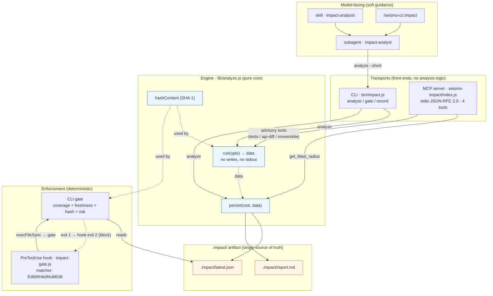

# seismo-cc Architecture: One Engine, Two Transports

This document describes the runtime architecture of **seismo-cc**, a Claude Code plugin that performs *impact analysis before modifying code*. The central design decision is a strict separation between a single pure computation core (`lib/analyze.js`) and the surfaces that invoke it — a command-line interface (`bin/impact.js`) and a Model Context Protocol server (`src/mcp-servers/seismo-impact/index.js`) — plus a deterministic `PreToolUse` guard (`hooks/impact-gate.js`) that gates file edits against the artifact the core produces. seismo-cc is a *heuristic*: it combines textual reference search, git co-change mining, and rule-based risk scoring. It is not true reachability analysis or a program-graph change-impact analysis (CIA), and the architecture is deliberately built so that this heuristic can never silently masquerade as proof. This document sticks to what the code actually does, citing `file:line` where useful.

## Table of contents

1. [The one-engine, two-transports principle](#1-the-one-engine-two-transports-principle)
2. [The engine: `run` and `persist`](#2-the-engine-run-and-persist)
3. [CLI transport (`bin/impact.js`)](#3-cli-transport-binimpactjs)
4. [MCP transport (`src/mcp-servers/seismo-impact/index.js`)](#4-mcp-transport-srcmcp-serversseismo-impactindexjs)
5. [The PreToolUse guard (`hooks/impact-gate.js`)](#5-the-pretooluse-guard-hooksimpact-gatejs)
6. [Plugin packaging](#6-plugin-packaging)
7. [Component diagram](#7-component-diagram)
8. [Design consequences and honest limits](#8-design-consequences-and-honest-limits)

---

## 1. The one-engine, two-transports principle

Every path that computes an impact analysis in seismo-cc goes through exactly one function: `run(opts)` in `lib/analyze.js`. The CLI and the MCP server are *transports* — they translate their respective wire formats (argv strings, JSON-RPC parameters) into an `opts` object, call `run`, optionally call `persist`, and translate the returned `data` back out (stdout text, JSON-RPC results). Neither transport contains any analysis logic of its own.

The header comment of `lib/analyze.js:2-12` states the invariant plainly: the CLI and the MCP server "both call the SAME `run()` then `persist()`. A single computation path, a single `.impact/latest.json` artifact — that's what guarantees the PreToolUse gate always sees the report the analysis just wrote, whatever its source."

Why this matters for the gate specifically: the guard (`hooks/impact-gate.js`) does not re-run any analysis. It reads a persisted artifact (`.impact/latest.json`) and enforces against it. If the CLI and the MCP server each had their own notion of "scope" or their own artifact format, the guard could be shown a file that *one* transport considered covered and *another* did not. Because both transports serialize the identical `data` object through the identical `persist` routine, the guard's coverage check is well-defined regardless of how the analysis was triggered. The engine is the single source of truth; the transports are interchangeable front-ends; the guard is a consumer of the artifact, never a re-implementation of the engine.

A second structural rule reinforces this: **`run` has no side effects.** It performs no writes and emits nothing to stdout (`lib/analyze.js:9-11`). Materialization is the sole responsibility of `persist`. This lets a caller compute without writing (dry-run, tests) — but, critically, *any transport that wants to feed the gate must explicitly call `persist`* (`lib/analyze.js:298-300`). Whether the artifact is written is therefore a deliberate per-call decision, which is exactly the lever the MCP server uses to distinguish scope-defining tools from advisory queries (see §4).

---

## 2. The engine: `run` and `persist`

### 2.1 `run(opts)` — pure computation

`run(opts)` accepts `{ root, symbols, files, diff, base, workspace }` and returns a plain `data` object. `symbols` and `files` may be either an array (natural for MCP) or a comma-separated string (natural for the CLI); `toList` (`lib/analyze.js:33-37`) normalizes both, keeping the core agnostic to its caller. This dual-shape acceptance is what makes "one engine, two transports" ergonomic rather than forced.

The pipeline, in order (`lib/analyze.js:132-294`):

1. **Resolve config and scope.** `config.load(root)` yields the effective configuration; an explicit `opts.workspace` overrides `cfg.workspace` (`:134-135`). The mode is `'diff'` when `opts.diff` is set, otherwise `'plan'` (`:138`). In diff mode the base defaults to `origin/main` (`:139`) and the changed files from git are unioned into the target set (`:146`). Target paths are then filtered through `scan.filterPaths` against config ignore rules (`:148`).
2. **Infer symbols from files when none given.** If files were supplied but no symbols, the engine extracts declarations and picks search targets, preferring *types* over members because a bare property name like `Status` generates mostly noise; members are only added when fewer than three types were found, and are length- and count-capped (`:152-167`). The final symbol list is capped at 12.
3. **Locate declarations and references.** For each symbol name, *all* declaration sites are collected, not just the first, so that homonyms across namespaces are detected and flagged `ambiguous` rather than papered over with false precision (`:175-207`). This is explicitly motivated by C#/.NET namespace clashes (`:178-179`). Call sites external to the declaring file are counted per symbol.
4. **Historical coupling.** `git.coupling` mines co-change from git history over a seed of target files plus declaration files, subject to `gitDepth`, `couplingMinCommits`, and `couplingMinRatio` thresholds (`:209-220`). See `07-git-historical-coupling.md`.
5. **Risk rules.** Over an inspection set (targets + declaration files + top coupled files), the engine computes irreversible operations (`rules.irreversible`), public API surface (`rules.apiSurface`), and — only in diff mode with a base — a before/after breaking-change diff (`computeApiBreaking`), plus affected tests (`:222-235`). See `06-risk-model.md`.
6. **Optional cross-repo scan.** When a workspace is configured, `scanWorkspace` searches sibling git repos for the symbol names — deliberately capped and described in-code as "an alert signal, not a cross-repo graph" (`:39-66`, `:237-238`).
7. **Summary and risk level.** A `summary` aggregates counts (callers, API surface, cross-repo, external consumers, irreversible), and `rules.riskLevel(cfg, summary)` derives the `risk` verdict (`:240-247`).
8. **Advisory memory hints.** `memory.priorHints` is computed *after* risk and is explicitly never fed back into it, "so the gate stays deterministic"; it degrades to empty when `memoryPath` is unconfigured (`:249-252`). See `07-git-historical-coupling.md` and `08-configuration-reference.md`.
9. **Coverage fingerprints.** For every file the gate will treat as "covered" (targets, declaration files, all caller files, all coupled files), the engine records a SHA-1 content hash (`:257-267`). This `fileHashes` map is the mechanism that lets the guard detect a file that changed *after* analysis.

The returned object carries all of the above plus provenance (`repo`, `root`, `branch`, `head`, `base`, `generatedAt`, `configFound`, `filesScanned`) — see `lib/analyze.js:269-293`. Full field semantics are in `05-analysis-pipeline.md`.

### 2.2 `persist(root, data)` — the only writer

`persist` (`lib/analyze.js:301-308`) creates `.impact/`, renders Markdown via `report.render(data)`, and writes two files:

- `.impact/report.md` — the human/agent-readable report.
- `.impact/latest.json` — `JSON.stringify(data, null, 2)`, the machine artifact the guard reads.

It returns the rendered Markdown so the CLI can echo it without re-rendering. Because `persist` is the single write path and `run` writes nothing, the artifact on disk is always a verbatim serialization of one `run` result — never a partial or transport-specific view.

### 2.3 Content fingerprinting

`hashContent(s)` is a SHA-1 of the UTF-8 content (`lib/analyze.js:26-28`). The same function is exported and reused by the CLI's `gate` command (`bin/impact.js:24`), so the hash recorded at analysis time and the hash checked at gate time are computed identically. In LaTeX terms, for a covered file $f$ the guard admits an edit only when

$$\mathrm{sha1}\left(\text{content}_{\text{now}}(f)\right) = \text{fileHashes}[f],$$

i.e. the report still describes the file's current bytes.

### 2.4 `recordFromReverts` — the write path outside analysis

`recordFromReverts(cfg, root, depth)` (`lib/analyze.js:318-330`) mines recent `git revert` commits and feeds them into seismo-memory. It lives in the engine to stay DRY: both the CLI `record --from-reverts` command and the post-merge git hook call it. It is idempotent, non-blocking, and a no-op when `memoryPath` is absent or the root is not a git repo. Note this is *not* on the read-only analysis path — it is the deliberate exception where a non-`persist` write occurs.

---

## 3. CLI transport (`bin/impact.js`)

The CLI is a zero-dependency Node script (`bin/impact.js:3-6`) designed to drop into any repo without installation. `parseArgs` (`:26-39`) is a minimal `--key value` / `--flag` parser; positional args land in `_`. The dispatch on `args._[0]` supports three commands (`:203-221`), with an unknown/empty command printing usage.

### 3.1 `analyze`

`analyze(args)` (`:46-71`) is the canonical demonstration of the split: it calls `engine.run(...)`, then `engine.persist(data.root, data)`, then formats stdout. Three output formats:

- `--json`: pure JSON to **stdout**, with the status line diverted to **stderr** so that `impact analyze --json | jq` is not corrupted (`:58-62`). This stdout-purity discipline is a recurring theme (see also §4).
- `--short`: `report.renderShort(data)` — the compact form the subagent and skill invoke.
- default: the full rendered Markdown (the string returned by `persist`).

In all cases the artifact is written before stdout is produced, so an `analyze` invocation always leaves a gate-usable `.impact/latest.json` behind.

### 3.2 `gate`

`gate(args)` (`:80-152`) is the enforcement logic, invoked by the hook (§5). It never analyzes; it validates the persisted artifact against a target file. Sequence:

1. If `.impact/latest.json` is missing → fail with a copy-pasteable re-run command (`:91-93`). The command string is built from `CLAUDE_PLUGIN_ROOT` so it points at the plugin, not a tool-relative path (`:87-89`).
2. If unreadable/unparseable JSON → fail (`:95-101`).
3. **Freshness:** if the report's age in minutes exceeds `cfg.thresholds.reportMaxAgeMinutes` → fail (`:103-107`).
4. **Coverage:** the target, normalized to a repo-relative POSIX path, must be in the covered set — the union of `changedFiles`, symbol `declFile`s, `topCallers` files, and `coupling` files (`:109-120`). This set mirrors the coverage set the engine hashed (`lib/analyze.js:257-262`).
5. **Content freshness:** the file must have a recorded hash *and* its current hash must match (`:126-142`). A covered-but-unhashed file is rejected — a report predating content hashing cannot guarantee freshness, so re-analysis is required (`:133-138`). This closes the "analyze once, then rewrite everything before expiry" bypass (`:122-125`).
6. **Blocking risk:** if `data.risk.level === 'blocking'` → fail with the reasons and a demand for human validation (`:145-148`).

On success it prints `impact ok — risk <level> (<age> min)` and exits 0 (`:150-151`). `fail(msg)` writes to stderr and `process.exit(1)` (`:154-157`) — the hook translates that non-zero exit into Claude Code's blocking exit 2 (§5).

### 3.3 `record`

`record(args)` (`:169-198`) is the seismo-memory writer, explicitly outside the read-only analysis path. It refuses if `memoryPath` is unset (`:172-175`). Two modes: `--from-reverts` delegates to `engine.recordFromReverts` (`:177-183`); otherwise a manual single incident built from `--symbol`/`--file`/`--kind`/`--ref`/`--at` (`:185-197`). Both go through `memory.recordMany`, which deduplicates, making the command safe to replay.

Top-level errors from any command are caught and reported to stderr with exit 1 (`:222-225`).

---

## 4. MCP transport (`src/mcp-servers/seismo-impact/index.js`)

The MCP server is a **stdio JSON-RPC 2.0** transport with zero dependencies, requiring only the engine (`index.js:20`). It speaks newline-delimited JSON messages over stdin/stdout, reserving stdout strictly for the protocol; all diagnostics go to stderr (`:16-19`). Because `run` never writes to stdout and git runs in captured pipes, the protocol stream stays clean — the same stdout-purity discipline the CLI enforces with its `--json` status line.

### 4.1 The JSON-RPC loop

`send`/`ok`/`rpcError` (`:119-127`) emit one JSON object per line. `handle(msg)` (`:129-170`) implements the minimum viable MCP surface:

- `initialize` → echoes the client's requested `protocolVersion` when provided (falling back to `2024-11-05`), advertises `capabilities.tools`, and returns `serverInfo` (`:135-143`).
- `notifications/initialized` and `notifications/cancelled` → ignored, no response (`:133`).
- `ping` → empty result (`:145`).
- `tools/list` → the tool metadata (`:147-151`).
- `tools/call` → dispatch by name (§4.3).
- Unknown method *with* an id → `-32601 method not found`; unknown notification → ignored (`:169`).

The read loop (`:172-189`) buffers stdin, splits on newlines, trims, skips blank lines, and — importantly — silently ignores non-JSON lines (`:182-186`) rather than crashing. `stdin` `error`/`end` both exit 0 (`:191-192`) so an abnormally closed pipe never throws an uncaught exception.

### 4.2 The four tools

| Tool | Calls `run` with | Persists? | Returns |
|---|---|---|---|
| `get_blast_radius` | `{symbols, files}` | **Yes** | risk, callers, symbols, top callers, coupling, cross-repo, external consumers, prior hints, report path |
| `get_affected_tests` | `{diff, base, files}` | No | affected tests + count |
| `get_public_api_diff` | `{diff:true, base}` (base required) | No | public surface + breaking changes |
| `get_irreversible_ops` | `{diff, base, files}` | No | irreversible ops + a derived gate threshold |

Definitions: `get_blast_radius` (`:30-57`), `get_affected_tests` (`:58-75`), `get_public_api_diff` (`:76-92`), `get_irreversible_ops` (`:93-114`).

### 4.3 Why only `get_blast_radius` persists

This is the load-bearing design point of the MCP transport. `get_blast_radius` is the tool that *defines the scope before an edit*, so its `run` is immediately followed by `engine.persist(d.root, d)` (`:43-44`) — writing the artifact is precisely what makes the analysis enforceable by the gate (`:27-28`).

The other three are **advisory queries**: they compute and return without ever calling `persist` (`:71-74`, `:88-91`, `:106-113`). The header comment explains why this is not an oversight but a correctness requirement (`:6-14`): if an advisory tool overwrote `.impact/latest.json`, a narrower-scoped call (say, "which tests does this one file affect?") would clobber the broader coverage that `get_blast_radius` had just established. The gate would then block a file that *had* in fact been analyzed. The rule is summarized in-code: *"The agent queries (advisory); the hook enforces (deterministic). MCP does not replace the gate, it feeds it."* (`:13-14`).

`get_irreversible_ops` additionally maps the worst irreversible weight to a gate label — `blocking` at weight $\geq 5$, `high` at $\geq 3$, else `none` (`:107-112`) — surfacing to the agent the same threshold logic the risk model uses, without itself persisting anything. See `06-risk-model.md`.

### 4.4 Error discipline

Application errors from a tool (not a git repo, missing symbol, etc.) are returned as a *successful* JSON-RPC result carrying `isError: true` and a text message, not as a protocol-level error (`:160-165`). The rationale is that the agent should read and act on the message rather than experience an opaque transport failure. Only genuinely unknown tools yield a real `-32602` error (`:156`).

---

## 5. The PreToolUse guard (`hooks/impact-gate.js`)

The guard is what turns the analysis from a suggestion into an enforced precondition. Its purpose, stated at `hooks/impact-gate.js:6-8`: prevent the agent from modifying a file before it has looked at the scope — "the 'the agent is prevented' part — without it, the skill is just a suggestion the agent will ignore the moment it is in a hurry."

### 5.1 Claude Code hook contract

The hook consumes the tool call's JSON on stdin and communicates via exit code (`:10-16`): exit 0 lets the call through; exit 2 blocks it and sends stderr back to the model. The code notes that a JSON `permissionDecision: "deny"` variant exists but that exit 2 is the most stable path for Edit/Write (`:14-16`).

### 5.2 What it guards, and what it lets through

The guard reads stdin (`:38-42`), then resolves the target from `tool_input.file_path` / `.path` / the first entry of an `edits` array (`:46`), covering Edit, Write, and MultiEdit shapes. It then applies a deliberately permissive filter — the design philosophy being that "a gate that fires on everything is a gate the team turns off" (`:31-32`):

- No identifiable target → pass (`:51`).
- Extension not in `GUARDED` (`.cs .php .kt .kts .ts .tsx .sql .razor .cshtml`, `:33`) → pass (`:52`).
- Path matches `SKIP` (`.impact/`, `obj|bin|node_modules|vendor`, test directories, `:36`) → pass (`:53`).
- File does not yet exist (brand-new file) → pass, since there is nothing upstream to break (`:55-56`).

### 5.3 Delegation to the CLI gate

For a guarded, existing file the hook shells out to `bin/impact.js gate --root <cwd> --file <target>` via `execFileSync` with a 20 s timeout (`:58-62`). It does *not* re-implement any check — it reuses the CLI `gate` (§3.2), which reads `.impact/latest.json`. If `gate` exits 0, the hook exits 0. If `gate` exits non-zero, `execFileSync` throws; the hook captures `stderr`/`stdout`/`message` and emits a framed block (`:64-81`) that:

1. States explicitly that this is an **automatic guard, not a user refusal**, and instructs the agent to continue autonomously — wording chosen because a hook block is otherwise misread as a user refusal and the agent stops instead of fixing (`:66-68`).
2. Embeds the underlying `gate` reason.
3. Lists the expected recovery steps: run the analysis, read and summarize `.impact/report.md`, ask for validation only if risk is BLOCKING or consumer repos are affected, otherwise retry.

Then it exits 2 to block the edit (`:80`). The net effect: the guard is a thin, deterministic enforcement shell around the same `gate` logic the CLI exposes, which in turn reads the same artifact the engine's `persist` wrote — closing the loop back to §1.

---

## 6. Plugin packaging

seismo-cc ships as a Claude Code plugin. `.claude-plugin/plugin.json` declares the manifest (name `seismo-cc`, version `0.1.0`, Apache-2.0) and, notably, registers the MCP server (`plugin.json:10-15`):

```json
"mcpServers": {
  "seismo-impact": {
    "command": "node",
    "args": ["${CLAUDE_PLUGIN_ROOT}/src/mcp-servers/seismo-impact/index.js"]
  }
}
```

`${CLAUDE_PLUGIN_ROOT}` is expanded by Claude Code to the installed plugin directory, and the same variable is used throughout the CLI, hook, skill, and agent so every path is plugin-relative rather than cwd-relative. `.claude-plugin/marketplace.json` is the marketplace descriptor pointing at `source: "."` with `strict: true` (`marketplace.json:8-17`).

The plugin bundles five activation surfaces, each triggered differently:

| Component | File | Activation |
|---|---|---|
| **MCP server** | `src/mcp-servers/seismo-impact/index.js` | Launched by Claude Code per `mcpServers` in `plugin.json`; exposes the 4 tools over stdio. |
| **PreToolUse hook** | `hooks/hooks.json` → `hooks/impact-gate.js` | Fires automatically on every `Edit\|Write\|MultiEdit` tool call, 30 s timeout (`hooks.json:3-14`). Deterministic; no model involvement. |
| **Skill** | `skills/impact-analysis/SKILL.md` | Model-invoked by description match: it decides *when* to request analysis and *what to do with the verdict* (it does not analyze itself). Maps risk → action and tells the agent how to react when the guard blocks. |
| **Subagent** | `agents/impact-analyst.md` | Read-only analyst (tools restricted to Read/Grep/Glob/Bash, write tools disallowed, `model: sonnet`). Launched via the Task tool so that reading many call sites burns *its* context, not the main session's. Runs the CLI `analyze --short` and reports ~15 dense lines in a fixed format. |
| **Slash commands** | `commands/*.md` | Three manual entry points, all delegating to the `impact-analyst` subagent: `/seismo-cc:impact [symbol\|file\|--diff]` (full scope, defaulting to the current diff vs `origin/main` when no argument is given), `/seismo-cc:tests [symbol\|file\|--diff]` (only the affected tests, each labelled `structural`/`historical`), and `/seismo-cc:api-diff [--base <ref>]` (only the breaking public-surface changes vs a base). |

The layering is intentional: the **hook** is the hard, deterministic floor (an edit is physically blocked without a fresh covering report); the **skill** and **subagent** are the soft, model-facing layer that guides the agent to produce that report *before* it hits the floor and to interpret the verdict honestly. The MCP `get_blast_radius` tool and the CLI `analyze` command are the two ways the covering artifact gets written; everything else reads it.

### 6.1 Surfaces — when each is used

The same engine is reachable through several surfaces; what differs is the trigger and who invokes it. The three slash commands are scoped views (full scope / tests only / breaking-change only), all delegating to the read-only subagent.

| Surface | Triggered when | Invoked by |
|---|---|---|
| Skill `impact-analysis` | a task touches existing code, or the user asks "what's the impact / what does this break / is it risky", or before opening a PR | automatically (description match) |
| Subagent `impact-analyst` | the skill or a slash command decides to delegate | launched via the Task tool |
| `/seismo-cc:impact [symbol\|file\|--diff]` | manual request for the full impact scope | the user |
| `/seismo-cc:tests [symbol\|file\|--diff]` | manual request for only the affected tests | the user |
| `/seismo-cc:api-diff [--base <ref>]` | manual request for only breaking public-surface changes vs a base | the user |
| PreToolUse hook (gate) | every `Edit`/`Write`/`MultiEdit` on a guarded file | automatically (blocks if no fresh covering report) |
| MCP `get_blast_radius` | the agent needs the full scope and to persist coverage for the gate | the agent (only MCP tool that writes the report) |
| MCP `get_affected_tests` / `get_public_api_diff` / `get_irreversible_ops` | the agent needs a scoped, advisory answer without persisting | the agent |
| CLI `analyze` / `gate` / `record` | outside Claude Code — terminal, CI, git hook | user / CI |

---

## 7. Component diagram



The diagram makes the invariant visible: **all arrows into `.impact/` originate from `persist`**, and among the MCP tools only `get_blast_radius` reaches `persist` — the advisory tools stop at `run`. The gate reads only the artifact and never touches the engine directly.

---

## 8. Design consequences and honest limits

The architecture buys several properties:

- **Determinism of enforcement.** The guard is a pure function of `.impact/latest.json` and the target file's current bytes. No model, no network, no time-dependent behavior beyond the explicit age threshold. Advisory memory hints are computed after risk and never fed back in (`lib/analyze.js:249-252`), so the risk verdict — and thus the gate — is reproducible for a given tree and config.
- **Single artifact, no reconciliation.** Because both transports serialize the identical `data` through `persist`, there is no cross-transport merge or precedence logic to get wrong. The advisory/persisting split in the MCP server (§4.3) is the *only* place where "should this write?" is decided, and it is decided per tool, statically.
- **Fail-open on ambiguity, fail-closed on risk.** The guard lets through anything it cannot confidently attribute to a guarded, existing, in-scope, changed file (§5.2), reflecting the stated belief that an over-eager gate gets disabled. It fails closed only on genuine signals: missing/stale/unhashed coverage or `blocking` risk. There is deliberately no `--force`.

The honest limits, which the code and its sibling docs are explicit about:

- seismo-cc is a **heuristic**, not a sound analysis. Reference finding is textual name matching (subject to homonyms — hence the `ambiguous` flag), coupling is git co-change frequency, and risk is rule-based pattern scoring. It does not resolve types, does not build a call graph, and cannot see reflection, convention-based DI, hardcoded SQL, database-configured jobs, or view bindings. The subagent and skill are instructed to say "the report identifies 47 sites", never "there are 47 sites" (`agents/impact-analyst.md:62`, `skills/impact-analysis/SKILL.md:52`).
- Cross-repo scanning is a capped alert signal, not a cross-repo graph (`lib/analyze.js:41-43`).
- The analysis reduces ignorance up front; it proves nothing and never replaces compiling and running the tests.

For the theory and the specific algorithms behind each stage, see `02-scientific-concepts.md`, `03-mathematical-model.md`, `04-algorithms-and-complexity.md`, `05-analysis-pipeline.md`, `06-risk-model.md`, and `07-git-historical-coupling.md`. Configuration knobs (thresholds, external consumers, ignored paths, test conventions, `memoryPath`) are documented in `08-configuration-reference.md`, and the full catalogue of blind spots and validity conditions in `09-limitations-and-validity.md`. The document set is indexed by `README.md`.
