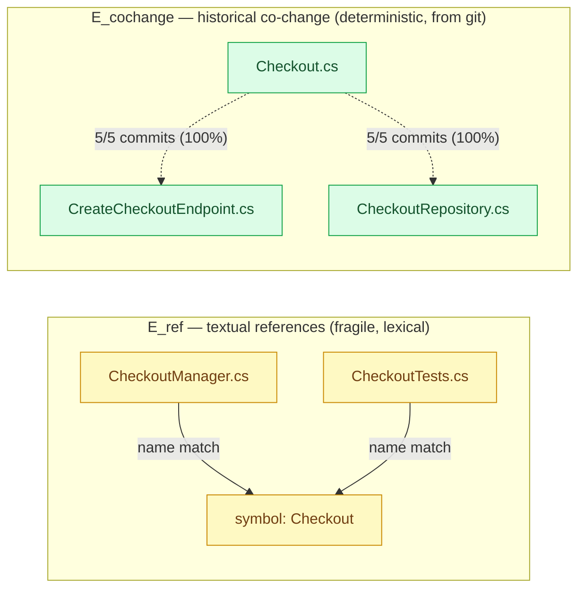

# Scientific Concepts Behind seismo-cc

> Situating a pragmatic impact-analysis tool in the Software Engineering research literature — and being honest about the gap between the textbook concept and what the code actually computes.

## Abstract

`seismo-cc` answers one operational question before an edit: *if I change this symbol or file, what else is likely to be affected, and how risky is that?* Academically, this is **Change Impact Analysis (CIA)**, a research area with roots in the early 1990s. This document defines the scientific concepts the tool draws on — change impact analysis, the program-as-graph model, reachability, static analysis, evolutionary coupling from Mining Software Repositories (MSR), coupling metrics, and the sound/heuristic distinction — and states *precisely* which of them `seismo-cc` realizes, which it approximates, and which it deliberately does not attempt.

The honest one-line summary, which the rest of the document justifies: **`seismo-cc` is a heuristic, one-hop, lexical impact estimator fused with a deterministic historical co-change signal. It is neither a sound reachability analysis nor a graph-theoretic CIA.** Every claim below is checked against `lib/scan.js`, `lib/git.js`, `lib/rules.js`, and `lib/analyze.js`.

## Table of contents

1. [Change Impact Analysis (CIA)](#1-change-impact-analysis-cia)
2. [Software as a directed graph](#2-software-as-a-directed-graph)
3. [Reachability vs. direct neighbours](#3-reachability-vs-direct-neighbours)
4. [Static analysis vs. lexical reference search](#4-static-analysis-vs-lexical-reference-search)
5. [Logical / evolutionary coupling (MSR)](#5-logical--evolutionary-coupling-msr)
6. [Fan-in, fan-out, and coupling metrics](#6-fan-in-fan-out-and-coupling-metrics)
7. [Heuristic vs. sound analysis](#7-heuristic-vs-sound-analysis)
8. [Literature map](#8-literature-map)
9. [Cross-references](#9-cross-references)

---

## 1. Change Impact Analysis (CIA)

**Definition.** Change Impact Analysis is the activity of identifying the potential consequences of a change, or estimating what needs to be modified to accomplish a change (the formulation popularised by Arnold and Bohner in the early-to-mid 1990s). CIA starts from a **change set** (the entities a developer intends to modify — the *starting impact set*, SIS) and derives an **estimated impact set** (EIS): the entities that may need to change or be re-verified as a consequence.

Two broad families are usually distinguished:

- **Static CIA** — reasons about the program's *structure* (call graphs, dependencies, type relations) without running it. It is conservative in principle: it aims to over-approximate so nothing is missed.
- **Dynamic CIA** — uses *execution* information (traces, coverage, profiling) to see what actually interacts at run time. More precise on the exercised paths, but only as good as the executions observed.

The core intuition CIA formalises is the **ripple effect** (Yau, Collofello) — a change propagates outward from its origin through dependencies — and its practical cousin the **blast radius**: the set of things plausibly disturbed by a change.

**What seismo-cc realizes.** `seismo-cc` is a CIA tool in the operational sense: `lib/analyze.js#run()` takes a SIS (explicit `--symbols`, explicit `--files`, or the git diff in `--diff` mode) and produces an EIS made of *callers*, *historically coupled files*, *affected tests*, *public-surface elements*, and *irreversible operations*. But it is a **third kind**, neither classically static nor dynamic:

- It is **not dynamic** — it never executes the code, collects no traces, needs no test run.
- It is **not static in the sound sense** — it does not build a real call graph or resolve types (see §3, §4).
- Its structural half is a **lexical/heuristic static estimate**; its historical half is an **evolutionary (MSR) estimate** mined from version control.

So the "blast radius" `seismo-cc` reports (the MCP tool is literally named `get_blast_radius`) is an *estimate of plausible disturbance*, explicitly fused from two signals of different natures. The tool never claims completeness; `lib/rules.js#riskLevel()` returns human-readable `reasons`, and the report carries a "Blind spots" section (see [09-limitations-and-validity.md](09-limitations-and-validity.md)).

---

## 2. Software as a directed graph

**Definition.** A standard model represents a program as a directed graph $G = (V, E)$ where vertices $V$ are program entities and edges $E$ are dependencies. Depending on granularity, $V$ may be functions/methods (call graph), types (type-dependency graph), files/modules (module graph), or statements (program dependence graph). An edge $A \rightarrow B$ typically means "$A$ depends on / references / calls $B$."

**What seismo-cc realizes.** `seismo-cc` works with a graph, but an *implicit, never-materialised* one, and crucially with **two distinct edge types** that must not be confused:

Let the vertex set be

$$V = S \cup F$$

where $S$ is the set of extracted **symbols** (types and methods/properties found by the regex declaration extractors in `lib/scan.js#declarations`, per-language in the `DECL` table) and $F$ is the set of **files** in scope (from `scan.walk`). Then there are two edge relations:

1. **Textual reference edges** $E_{\text{ref}} \subseteq F \times S$.
   `scan.references(root, files, symbol, declFile)` scans every file for the symbol's name with the boundary-guarded regex `(?<![\w$])<name>\b`, after stripping comments and string literals (`stripNoise`). A file $f$ that mentions symbol $s$ (outside its declaration and outside import lines) yields an edge $f \rightarrow s$. This is a *lexical* edge: it means "the text of $f$ contains a token equal to the name of $s$," not "the compiler resolves a call from $f$ to $s$."

2. **Historical co-change edges** $E_{\text{cochange}} \subseteq F \times F$.
   `git.coupling` mines the commit history and connects file $A$ to file $B$ when they changed together in enough commits (details in §5). This is a *statistical/temporal* edge derived from `git log`, entirely independent of $E_{\text{ref}}$ and entirely language-agnostic.

These two edge types answer different questions and have different confidence semantics — the report presents them under separate headings ("Callers — confidence: textual" vs "Historical coupling — confidence: historical (deterministic)"). Conflating them would be a category error: one is a fragile syntactic guess, the other a deterministic fact about how the repository has actually evolved.



The formal treatment of these sets and edges is developed in [03-mathematical-model.md](03-mathematical-model.md).

---

## 3. Reachability vs. direct neighbours

**Definition.** In graph terms, the *sound* impact set of a change to vertex $v$ is (an over-approximation of) the set of vertices that can **reach** $v$ — the transitive closure of the dependency relation. If $A$ calls $B$ and $B$ calls $C$, then a change to $C$ can ripple to $B$ and then to $A$: the reachable set of $C$ under the "is-called-by" relation is $\{B, A, \dots\}$, computed by a transitive traversal (BFS/DFS) over $G$.

The **direct neighbours** of $v$ are only the vertices one edge away — its immediate predecessors (direct callers, *fan-in*) or successors (direct callees, *fan-out*).

**What seismo-cc realizes.** `seismo-cc` computes **direct callers only — approximately one hop of $E_{\text{ref}}$, and it does not traverse further.** For each symbol, `analyze.js` calls `scan.references` exactly once and stops. There is no work-list, no recursion, no transitive closure over the reference relation. Formally it computes

$$\text{callers}(s) = \{\, f \in F : f \rightarrow s \in E_{\text{ref}},\ f \neq \text{declFile}(s) \,\}$$

and the `callSites` counter is $\sum_{f} \lvert \text{distinct-lines}(f, s)\rvert$ — a fan-in count, not a reachable-set size. It does **not** then take those caller files, extract *their* symbols, and search for *their* callers. So if `A` references `B` and `B` references `C`, changing `C` surfaces `B` but never automatically surfaces `A`.

**Why the tool stops at one hop.** This is a deliberate consequence of the "works on any repo with no build" constraint:

- **No type resolution.** Without a compiler/AST, the tool cannot know that a textual `save()` in file `A` is *the* `save()` declared in `B` rather than an unrelated homonym. Chaining unreliable one-hop edges compounds the error: a transitive closure over lexical edges would explode into noise within two or three hops (each false-positive edge spawns a whole false subtree). One hop keeps precision defensible; more hops would not.
- **No build, no call graph.** A genuine reachability analysis needs a resolved call/dependency graph. Building one requires exactly the compilation step `seismo-cc` refuses to depend on.

The practical mitigation for the missing transitive structural reach is the *other* edge type: **historical coupling recovers many multi-hop and non-syntactic relationships for free** (§5) — precisely the propagation a one-hop lexical scan cannot see. This trade-off, and what it misses, is analysed in [09-limitations-and-validity.md](09-limitations-and-validity.md); the complexity consequences of *not* doing a closure (linear per symbol instead of worst-case quadratic/exponential traversal) are in [04-algorithms-and-complexity.md](04-algorithms-and-complexity.md).

---

## 4. Static analysis vs. lexical reference search

**Definition.** *Static program analysis* reasons about program behaviour from source or bytecode using a formal model: lexing → parsing to an **AST**, name/type resolution (a symbol table, scope and type rules), and often control-flow (CFG) and data-flow analyses. It can, in principle, prove properties (e.g. "this call definitely resolves to that method") because it models the language semantics.

A *lexical / textual reference search* operates on the character stream: regular expressions, token boundaries, maybe a shallow import heuristic. It has no notion of scope, type, or binding. `grep` is its archetype.

**What seismo-cc realizes.** `seismo-cc` is firmly on the lexical side, by explicit design. The comment in `lib/scan.js` states it: declaration extraction is *"deliberately based on regular expressions rather than a parser … a conscious trade-off: it works on any repo without a build, at the cost of false negatives on exotic cases."* Concretely:

- **Declarations** come from per-language regex tables (`DECL.cs`, `DECL.php`, `DECL.kt`, `DECL.ts`), not from an AST.
- **References** are regex name matches with a boundary lookbehind, over a *roughly* comment- and string-stripped copy of the file (`stripNoise` — itself regex-based, and honest that *"a real parser would require a build"*).
- **"Type/dataflow" is absent.** There is no CFG, no dataflow, no symbol table proper.

It is, however, **more than a bare `grep`** — a set of heuristics push it partway toward resolution without ever parsing:

- an **import graph**: `importedNames`, `importPathFor`, `moduleOf` parse `use` / `import` / `namespace` lines and compare the **full import path** to tell apart cross-module homonyms (`use App\A\Order` vs `use App\B\Order`);
- a **qualifier heuristic**: `qualifierBefore` inspects the token immediately before a match to see whether it is a member access (`.`, `->`), a static access (`::`), or an instantiation (`new` / `instanceof`) — a qualified site is stronger evidence of a real reference;
- a resulting per-caller **`confidence` tag** (`high` / `normal` / `low`).

Two consequences of staying lexical, both acknowledged in the code and README:

1. **False positives** — homonyms in different namespaces, overloads not distinguished, generic names (`Status`, `Handle`) that match everywhere. Mitigated by the `NOISE` blocklist, a minimum name length, the priority given to *types* over members in `analyze.js`, and the confidence downgrade — but never eliminated.
2. **False negatives** — anything the name cannot see: reflection, `Type.GetType`, convention-based DI, symbols built by string concatenation, unnamed template bindings. A parser would catch some of these; a lexical scan cannot.

The `confidence` machinery is *additive* — it annotates and re-orders ties but, by design, does **not** change the raw call-site counts that feed the risk score, so the calibrated .NET path is unchanged. See [03-mathematical-model.md](03-mathematical-model.md) for how confidence is assigned and [09-limitations-and-validity.md](09-limitations-and-validity.md) for the full error taxonomy.

---

## 5. Logical / evolutionary coupling (MSR)

**Definition.** *Logical* (a.k.a. *evolutionary* or *change*) coupling is the observation that two artifacts are related if they *change together over time*, regardless of whether any static dependency links them. It comes from **Mining Software Repositories (MSR)**: Gall et al. introduced logical coupling from release history in the late 1990s; Zimmermann et al. ("Mining Version Histories to Guide Software Changes", mid-2000s) framed it with **association-rule** mining and the memorable slogan *"programmers who changed these functions also changed …"*.

The association-rule view: from the transaction database of commits (each commit = a set of files changed together), mine rules $A \Rightarrow B$ with two standard measures:

$$\text{support}(A \Rightarrow B) = \frac{\lvert \{c : A \in c \wedge B \in c\} \rvert}{\lvert \text{commits} \rvert}, \qquad \text{confidence}(A \Rightarrow B) = \frac{\lvert \{c : A \in c \wedge B \in c\} \rvert}{\lvert \{c : A \in c\} \rvert}.$$

Confidence is exactly the conditional probability $P(B \in c \mid A \in c)$ — *given that a commit touched $A$, how often did it also touch $B$?*

**What seismo-cc realizes — this is the tool's strongest and most language-agnostic signal.** `git.coupling` in `lib/git.js` computes association-rule confidence directly. For each seed file $f$:

```js
const touching = commits.filter(c => c.files.includes(f));   // commits containing A
...
const ratio = n / touching.length;                           // n = commits containing A AND B
```

so `ratio` $= n / \lvert\{c : f \in c\}\rvert = P(\text{other} \mid f) = \text{confidence}(f \Rightarrow \text{other})$. The tool keeps a rule only if it clears two thresholds (defaults, configurable per repo):

- $n \ge$ `minCommits` (default 3) — a minimum **support count**, so a single coincidental co-edit is discarded;
- `ratio` $\ge$ `minRatio` (default 0.4) — a minimum **confidence**.

Two implementation details matter scientifically:

- The commit index (`commitIndex`) runs `git log` **without a pathspec** — a pathspec would make `--name-only` list only the matching file and hide all co-change. It uses `-m --first-parent` so merges are not empty, then `parseLog` **deduplicates by SHA and by file** so `-m` (which repeats a merge once per parent) does not inflate the counts. Correct support/confidence depend on this dedup.
- The metric is **asymmetric and directional**: `via: f` records which seed produced the rule, and `P(B\mid A) \neq P(A\mid B)` in general. `seismo-cc` reports $P(\text{other}\mid\text{seed})$ and keeps, per coupled file, the entry with the highest ratio across all seeds.

**Why it is the strongest signal.** It is *deterministic* (same history → same numbers, no heuristics), *free* (only reads git), and — decisively — it captures relationships **static analysis structurally cannot see**: config rows in a database, hardcoded SQL, reflection, convention-based DI, documentation that must move with the code. It is also the tool's answer to the missing transitive reach of §3: files that "always change together" encode real, transitively-propagating impact that no one-hop name scan would find. The README calls it "the heart of the tool," and the code treats it accordingly — it is the one signal that behaves identically across C#, PHP, Kotlin, TypeScript, or any other language, because it never looks at the source at all.

The one caveat is intrinsic to MSR: **a young repository yields nothing.** Below `minCommits` touching a file, the history section is empty — deliberately, because below that threshold co-change is noise, not signal. The full derivation, threshold calibration, and the support/confidence/lift discussion are in [07-git-historical-coupling.md](07-git-historical-coupling.md).

---

## 6. Fan-in, fan-out, and coupling metrics

**Definitions.**

- **Fan-in** of an entity = number of other entities that depend on / call it (its in-degree under the "depends-on" edge). High fan-in ⇒ widely used ⇒ risky to change.
- **Fan-out** = number of entities it itself depends on (out-degree). High fan-out ⇒ depends on much ⇒ fragile.
- **Coupling Between Objects (CBO)** (Chidamber & Kemerer) = the number of other classes a class is coupled to (either direction). A classic OO complexity metric.
- **Centrality** measures (degree, betweenness, PageRank-style) rank a vertex by its structural importance in the whole graph.

**What seismo-cc approximates, and what it does not.**

| Metric | Realized? | How / why not |
|---|---|---|
| **Fan-in** | **Approximated** | `callSites` / `files` per symbol *is* a lexical in-degree over $E_{\text{ref}}$ — the count of caller sites/files. It is the tool's central structural number and feeds `callersWarn` / `callersHigh` in `riskLevel`. Approximate because lexical (homonyms inflate it, reflection deflates it). |
| **Fan-out** | **Not computed** | The tool never enumerates the symbols a given entity *depends on*. It searches for callers *of* a symbol, not callees *from* it. |
| **CBO** | **Not computed** | No class-to-class coupling count is built; there is no resolved type graph to count it on. |
| **Centrality** | **Not computed** | No global graph is materialised, so no degree/betweenness/PageRank ranking exists. Ranking is by raw `count`, then `confidence` as tie-breaker — a purely local ordering. |

The historical side has its own degree-like quantity — **churn** (`git.churn`, the number of commits touching a file) — used as an instability signal, not as a structural coupling metric. Note this is a *temporal* degree, not a graph degree.

So the accurate statement is: **`seismo-cc` measures a lexical fan-in and a temporal co-change confidence, and nothing else on the metric axis.** No fan-out, no CBO, no centrality. This is consistent with §3: computing fan-out or centrality would require the resolved, materialised graph the tool deliberately avoids building. See [03-mathematical-model.md](03-mathematical-model.md) for the metric definitions in the tool's own terms.

---

## 7. Heuristic vs. sound analysis

**Definition.** An analysis is **sound** (for a "may" property like impact) when it never misses a real element — its output is a guaranteed over-approximation, so **no false negatives** (at the cost of possible false positives). It is **complete / precise** when it reports nothing spurious — **no false positives**. In the classic precision/recall framing, with the true impact set $T$ and the reported set $R$:

$$\text{precision} = \frac{\lvert R \cap T\rvert}{\lvert R\rvert}, \qquad \text{recall} = \frac{\lvert R \cap T\rvert}{\lvert T\rvert}.$$

A sound analysis targets $\text{recall} = 1$. A **heuristic** makes no such guarantee — it trades both bounds for applicability, speed, or simplicity, accepting $\text{recall} < 1$ **and** $\text{precision} < 1$.

**What seismo-cc is.** `seismo-cc` is a **heuristic**, unambiguously and by design. It is neither sound nor complete:

- **False negatives (recall < 1)** — reflection, `Type.GetType`, convention-based DI, DB-configured jobs and feature flags, stored procedures/views/triggers, concatenated URLs, unnamed Razor/Blade/Compose bindings; and, structurally, anything more than one hop away (§3). The README lists these under "Structural false negatives."
- **False positives (precision < 1)** — homonyms across namespaces, undistinguished overloads, generic names. Listed under "False positives."

The tool does not pretend otherwise. Its design choices are all precision/recall management rather than soundness claims:

- the `NOISE` blocklist, minimum name length, and type-over-member priority **trade recall for precision** (drop noisy generic symbols to keep the report trustworthy);
- the import-graph + qualifier `confidence` layer **raises precision** on the best-effort stacks without touching the counts;
- historical coupling **raises recall** on exactly the relationships the lexical scan misses.

Crucially, the README states the real product risk is *the noise threshold*, not parser precision: "a report that cries wolf on every ticket is ignored within two weeks." That is an explicit editorial decision to bias toward **precision over recall** — "accept missing things rather than flagging everything." A sound CIA tool would make the opposite choice. `seismo-cc` is optimised to be *trusted and acted on*, not to be *complete*. The validity threats, and how one would empirically measure this precision/recall on real repos (`test/calibrate.js`), are the subject of [09-limitations-and-validity.md](09-limitations-and-validity.md).

---

## 8. Literature map

References are kept conceptual — the *idea* and the *typical authors*, not fabricated citations. Consult the originals for exact bibliographic data.

- **Change Impact Analysis, ripple effect.** Bohner & Arnold, *Software Change Impact Analysis* (the canonical reference collection); the starting-impact-set / estimated-impact-set vocabulary. Earlier, Yau and Collofello on the *ripple effect* of maintenance changes. This is the frame for §1 and the "blast radius" language.
- **Program-as-graph / dependency models.** Program Dependence Graphs (Ferrante, Ottenstein, Warren) and system dependence graphs (Horwitz, Reps, Binkley) underpin the graph model of §2 and the reachability/slicing view of §3. `seismo-cc` uses the vocabulary, not the machinery.
- **Static analysis foundations.** Standard compiler/analysis theory (AST, symbol resolution, CFG, dataflow) — the baseline §4 contrasts against. The planned Roslyn path (`MSBuildWorkspace` + `SymbolFinder.FindReferencesAsync`) in the README's "Path to v2" is exactly the move from lexical to sound static resolution.
- **Evolutionary / logical coupling (MSR).** Gall et al. on detecting logical coupling from release history; Zimmermann, Weißgerber, Diehl & Zeller on mining version histories to guide changes with association rules ("…also changed…"). Ball et al. on class-level co-change. This is the theory §5 implements.
- **Association-rule mining.** Agrawal, Imieliński & Swami (support/confidence) and Agrawal & Srikant (Apriori) — the origin of the support/confidence measures `git.coupling` computes, transplanted from market-basket analysis to commits-as-transactions.
- **Coupling metrics.** Chidamber & Kemerer's CBO and the broader coupling/cohesion metric literature; Henry & Kafura's information-flow (fan-in × fan-out) complexity — the metrics §6 places the tool against.
- **Learned defect/impact risk.** The direction in the README's v2 note (predicting risk from (impact report, incident) pairs; DRS-OSS, arXiv 2511.21964) — out of scope for the current heuristic engine but the natural successor to the deterministic rules.

---

## 9. Cross-references

- **[03-mathematical-model.md](03-mathematical-model.md)** — formal $G=(V,E)$, the two edge relations, caller/fan-in and coupling-confidence definitions, the confidence and risk formulae.
- **[04-algorithms-and-complexity.md](04-algorithms-and-complexity.md)** — why one-hop is linear per symbol, the cost of `references` and `commitIndex`, caching, and why a transitive closure was avoided.
- **[07-git-historical-coupling.md](07-git-historical-coupling.md)** — the full MSR/association-rule derivation, threshold calibration, merge dedup, and support/confidence/lift.
- **[09-limitations-and-validity.md](09-limitations-and-validity.md)** — the precision/recall error taxonomy, blind spots, soundness threats, and how calibration measures them.
