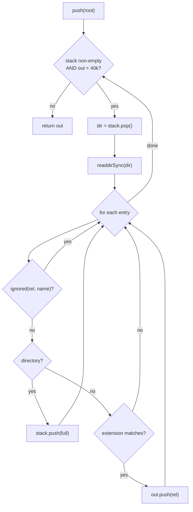
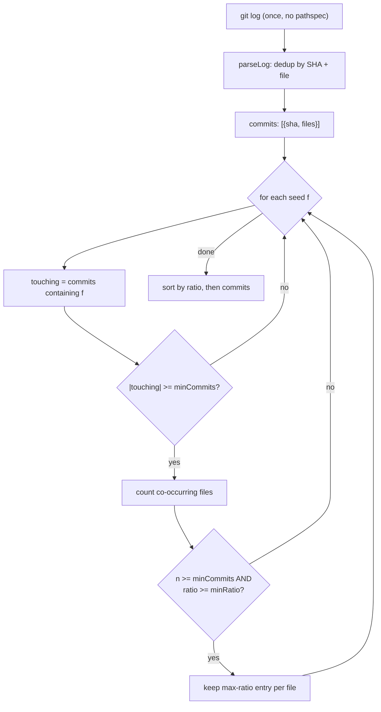

# 04 — Algorithms and Complexity

> A code-grounded walkthrough of every algorithm in the impact engine, with an
> honest complexity bound for each. The engine is a **lexical, heuristic**
> analyzer: it never builds an AST and never materializes a global program
> graph. This document explains exactly what each routine computes, how, and at
> what cost — and, just as importantly, what it deliberately does *not* compute.

## Abstract

`claude-impact` answers one question — *"if I touch this, what else moves?"* —
without a compiler, a language server, or a build step. That constraint is the
design: the tool must run inside a pre-tool-use hook, on any repository, in any
of C#/PHP/Kotlin/TypeScript, in well under a second. Every algorithm below is a
consequence of that constraint. Where a precise answer would require type
resolution or a reachability graph, the engine substitutes a *regex + string
search + confidence annotation* that is cheap, honest about its uncertainty, and
never silently wrong in a way that inflates the risk score.

The two source files under analysis are
[`lib/scan.js`](../lib/scan.js) (filesystem walk, declaration extraction, noise
stripping, the import graph, and reference counting) and
[`lib/git.js`](../lib/git.js) (commit indexing, co-change coupling, churn). The
orchestration that wires them together lives in
[`lib/analyze.js`](../lib/analyze.js) and is referenced where it fixes a loop
bound.

Throughout, let:

- $F$ = number of source files retained by the walk,
- $L_f$ = length (bytes/chars) of file $f$, and $L = \sum_f L_f$ the total scanned text,
- $S$ = number of target symbols,
- $C$ = number of commits in the history window (`gitDepth`, default 400),
- $\bar{k}$ = mean files touched per commit.

## Table of contents

1. [Directory walk — iterative DFS with segment-boundary ignore matching](#1-directory-walk--iterative-dfs)
2. [The read and declaration caches](#2-the-read-and-declaration-caches)
3. [Declaration extraction — per-language regex adapters](#3-declaration-extraction--per-language-regex-adapters)
4. [Noise stripping — approximate comment/string removal](#4-noise-stripping--approximate-commentstring-removal)
5. [The import graph and qualified-reference disambiguation](#5-the-import-graph-and-qualified-reference-disambiguation)
6. [`references` — name-based reference counting](#6-references--name-based-reference-counting)
7. [Git historical coupling](#7-git-historical-coupling)
8. [What is *not* computed — the graph algorithms we avoid](#8-what-is-not-computed--the-graph-algorithms-we-avoid)
9. [End-to-end complexity](#9-end-to-end-complexity-of-a-single-run)

Cross-references: the *why* behind the confidence tiers and the risk arithmetic
lives in [`03-mathematical-model.md`](./03-mathematical-model.md); the order in
which these routines fire during a run is in
[`05-analysis-pipeline.md`](./05-analysis-pipeline.md); the git side is expanded
in [`07-git-historical-coupling.md`](./07-git-historical-coupling.md); and the
failure modes each heuristic accepts are catalogued in
[`09-limitations-and-validity.md`](./09-limitations-and-validity.md).

---

## 1. Directory walk — iterative DFS

**Purpose.** Enumerate every source file the analyzer should consider, honoring
the configured ignore list and a hard file cap, without recursion (which would
risk a stack overflow on deep trees) and without pulling in build output,
vendored code, or generated files.

**Where.** [`lib/scan.js:28`](../lib/scan.js) (`walk`) and
[`lib/scan.js:10`](../lib/scan.js) (`ignored`).

### How it works, step by step

The walk is an **iterative depth-first search** driven by an explicit stack of
directories:

```js
const stack = [root];
while (stack.length && out.length < limit) {
  const dir = stack.pop();                 // LIFO => DFS
  entries = fs.readdirSync(dir, { withFileTypes: true }); // one syscall/dir
  for (const e of entries) {
    const rel = path.relative(root, full).split(path.sep).join('/');
    if (ignored(rel, e.name, cfg.ignore)) continue;       // prune subtree
    if (e.isDirectory()) stack.push(full);                // descend later
    else if (e.isFile() && cfg.extensions.some(ext => rel.endsWith(ext)))
      out.push(rel);
  }
}
```

Two design points deserve emphasis:

1. **`readdirSync` with `withFileTypes`** returns the `Dirent` objects, so the
   `isDirectory()`/`isFile()` test costs nothing extra — no second `stat` per
   entry. Directory type comes from the `readdir` result itself.
2. **Pruning happens before descent.** An ignored directory is never pushed onto
   the stack, so its entire subtree is skipped — the ignore list is a subtree
   prune, not a post-filter.



### The segment-boundary ignore fix (the "out" bug)

`ignored` is the subtle part. The naive implementation tests each ignore pattern
as a raw substring of the relative path. That is wrong, and wrong in the worst
possible direction for this tool: it *silently excludes legitimate source*. The
comment at [`lib/scan.js:5`](../lib/scan.js) names the real casualties:

- pattern `out` (meant for a build dir) matches `routes/web.php` — the substring
  "out" appears in "r**out**es";
- pattern `dist` matches `Distance.cs`;
- pattern `build` matches `query_builder.php`.

Those are exactly the files — routes, domain types, query builders — that make
up the public surface the tool exists to detect. So `ignored`
([`lib/scan.js:10`](../lib/scan.js)) matches on **path-segment boundaries**, in
three cases:

| Pattern shape | Rule | Example |
|---|---|---|
| starts with `*` | suffix glob on the **file name** | `*.min.js`, `*.designer.cs` |
| contains `/` | anchored on `/`-delimited boundaries via `` `/${rel}/`.includes(`/${p}/`) `` | `wwwroot/lib` |
| plain word | must be a **whole segment**: `segs.includes(pat)` | `out` matches `out/x.cs`, not `routes/web.php` |

The boundary trick for the plain case is `segs = rel.split('/')` followed by
`segs.includes(pat)` — an exact array-membership test, so `out` matches the
segment `out` and nothing else. For the multi-segment case, wrapping both sides
in slashes (`` `/${rel}/` `` vs `` `/${p}/` ``) guarantees the match starts and
ends on a separator, so `wwwroot/lib` cannot match `mywwwroot/library`.

### The 40k file cap

The loop condition includes `out.length < limit` with `limit = 40000`
([`lib/scan.js:28`](../lib/scan.js)). This is a guard rail, not a target: it
bounds worst-case time and memory on a pathological monorepo or an accidental
walk into `node_modules` that slipped past the ignore list. Because the cap is
checked in the *outer* `while`, a single huge directory can still push more than
40k files in one iteration before the check fires again — the cap is a soft
ceiling on the order of 40k, not an exact truncation. In practice the ignore
list keeps counts far below this.

### Complexity

Let $D$ be the number of directories visited and $F$ the number of files
inspected (before extension filtering). Each directory triggers one
`readdirSync`; each entry is examined once and run through `ignored`. `ignored`
itself is $O(|\text{ignore}| \cdot |\text{rel}|)$ per entry — the segment split
plus the per-pattern checks — but the ignore list is a small constant (a few
dozen patterns) and paths are short, so it is effectively $O(1)$ amortized.

$$
T_{\text{walk}} = O\!\left(D + F\right) \quad\text{syscalls + entry visits, capped at } F \le 40{,}000.
$$

No file *contents* are read here — only directory listings. Reading happens
lazily, later, and behind a cache (§2).

---

## 2. The read and declaration caches

**Purpose.** Make repeated content access free. Resolution walks the file list
**once per symbol** (see the loop at [`lib/analyze.js:175`](../lib/analyze.js)
and inside `references`), so the *same* files are read over and over.

**Where.** `_readCache` + `read` at [`lib/scan.js:56`](../lib/scan.js);
`_declCache` + `declarationsCached` at [`lib/scan.js:75`](../lib/scan.js).

### Why the cache is not optional

Without memoization, resolving $S$ symbols against $F$ files means each symbol's
pass re-reads every candidate file from disk. That is

$$
O(S \times F) \text{ disk reads}, \qquad O\!\left(S \cdot \sum_f L_f\right) = O(S \cdot L) \text{ bytes moved from disk.}
$$

The comment at [`lib/scan.js:53`](../lib/scan.js) states the motivation plainly:
"Resolution walks the tree once per symbol. Without a cache, we do
$O(\text{symbols} \times \text{files})$ disk reads, which becomes noticeable
beyond a few thousand files — and this path runs inside a hook." A hook has a
latency budget measured in hundreds of milliseconds; $S \times F$ synchronous
`readFileSync` calls blow it.

With the cache, each distinct file is read from disk **at most once** per
process. The first `read(root, rel)` performs the `stat` + `readFileSync`; every
later call for the same `(root, rel)` returns the cached string (or the cached
`null` for a miss). Total disk work collapses to:

$$
O(L) \text{ bytes read, once } — \text{ independent of } S.
$$

### Mechanics and bounds

- **Key.** `root + '' + rel` — a NUL separator so two repos with a shared
  suffix can't collide ([`lib/scan.js:60`](../lib/scan.js)).
- **Size gate.** Files larger than `2 * 1024 * 1024` bytes (2 MiB) are *not*
  read — `value` stays `null` ([`lib/scan.js:66`](../lib/scan.js)). This keeps a
  stray minified bundle or a checked-in binary from dominating the scan.
- **Cache ceiling.** New entries are inserted only while
  `_readCache.size < READ_CACHE_MAX` (`READ_CACHE_MAX = 20000`,
  [`lib/scan.js:57`](../lib/scan.js)). Past 20k distinct files the cache stops
  growing: further files still get read, but every access re-reads them. It is a
  **bounded** cache, not an LRU — there is no eviction, so the first 20k distinct
  files win the slots. Combined with the 40k walk cap, the cache covers at least
  half the maximal file set, and in practice all of a normal repo.
- **Declaration cache.** `_declCache` (keyed by `rel` alone) memoizes the regex
  extraction of §3, which is the second-most expensive per-file operation. It is
  **unbounded** — one entry per file ever passed to `declarationsCached`. That is
  safe precisely because $F$ is itself capped at 40k by the walk.

Both caches are module-level `Map`s, so they persist for the lifetime of the
Node process — which, for the CLI and the MCP server alike, is a single analysis
run. They are *not* invalidated on file change; correctness across edits is the
job of the content fingerprints in [`lib/analyze.js:263`](../lib/analyze.js), not
the cache.

---

## 3. Declaration extraction — per-language regex adapters

**Purpose.** Given a file's text, list the *symbols it declares* — types,
methods, properties — with their kind and line number. This feeds both symbol
discovery (when the caller gives files but no symbols,
[`lib/analyze.js:152`](../lib/analyze.js)) and the ambiguity/`declFile` logic
([`lib/analyze.js:181`](../lib/analyze.js)).

**Where.** `DECL` table at [`lib/scan.js:90`](../lib/scan.js), `adapterFor` at
[`lib/scan.js:115`](../lib/scan.js), `declarations` at
[`lib/scan.js:123`](../lib/scan.js).

### This is lexical, not an AST parse

The header comment at [`lib/scan.js:84`](../lib/scan.js) is explicit and worth
internalizing: extraction is "deliberately based on regular expressions rather
than a parser. This is a conscious trade-off: it works on any repo without a
build, at the cost of false negatives on exotic cases." There is no grammar, no
scope tree, no symbol table. A declaration is *whatever a per-language regex,
anchored with the multiline flag `m` at the start of a line, says it is.*

`adapterFor` maps a file extension to one of four adapters:

| Adapter | Extensions | Notes |
|---|---|---|
| `cs` | `.cs`, `.razor`, `.cshtml` | Razor/cshtml treated as C# for symbol purposes |
| `php` | `.php` | |
| `kt` | `.kt`, `.kts` | |
| `ts` | `.ts .tsx .js .jsx .vue` | one adapter for the whole JS/TS family |

Each adapter is a list of `{ kind, re, group }` rules. `declarations` runs every
rule with a `while ((m = re.exec(content)))` loop (resetting `re.lastIndex = 0`
first, since these are shared `/g` regexes), and for each match takes
`m[rule.group]` as the symbol name.

### Two guards that prune noise

After a match, [`lib/scan.js:132`](../lib/scan.js) applies two filters:

1. **Minimum length.** `if (!name || name.length < 3) continue;` — one- and
   two-character names are too generic to search for usefully.
2. **`NOISE` set.** A hand-curated stop-list ([`lib/scan.js:142`](../lib/scan.js))
   of names that *look* like symbols but are framework boilerplate or too generic
   to yield a meaningful reference count: `Main`, `Program`, `Startup`, `Get`,
   `Set`, `Handle`, `ToString`, `Index`, `Create`, `Update`, `Delete`, etc.
   Searching for "callers of `Create`" would return the whole repo and mean
   nothing.

### The C# adapter's deliberate strictness

The C# **method** rule ([`lib/scan.js:97`](../lib/scan.js)) requires *at least
one* access/behavior modifier:

```
(?:(?:public|private|internal|protected|static|virtual|override|async|sealed|new|abstract|partial)\s+)+
```

The comment explains why: without a mandatory modifier, `return Foo()` or
`throw New()` would be read as method declarations. The `+` (one-or-more) forces
a real signature. Type names are additionally constrained to start with an
uppercase letter (`[A-Z]\w*`), matching C# convention and shrinking false
positives. The TS adapter, by contrast, keys off the `export` keyword
([`lib/scan.js:110`](../lib/scan.js)) — only exported symbols are considered
"public surface," which is the right notion of a declaration that other files
can reach.

### Complexity

For a file of length $L_f$, each rule's global regex scans the text once, so the
per-file cost is $O(r \cdot L_f)$ where $r$ is the (small, constant) number of
rules for that adapter (2–3). Across all files, and memoized by `_declCache`:

$$
T_{\text{decl}} = O\!\left(\sum_f L_f\right) = O(L), \text{ computed once per file.}
$$

The one non-linear-looking helper is `lineOf` ([`lib/scan.js:148`](../lib/scan.js)),
which counts newlines from the start up to a match index — $O(\text{index})$ per
call, so $O(L_f)$ worst case per match. On declaration-dense files this is a real
cost, but declarations are sparse relative to lines, so in practice it stays well
within the $O(L)$ envelope.

---

## 4. Noise stripping — approximate comment/string removal

**Purpose.** Before counting references, blank out comments and string literals
so that the symbol name `Order` inside `// TODO: refactor Order` or `"select *
from Order"` is not miscounted as a code reference. The goal is to count *code*
uses, not *text* occurrences.

**Where.** `stripNoise` at [`lib/scan.js:194`](../lib/scan.js), with helpers
`keepCsHoles` ([`lib/scan.js:179`](../lib/scan.js)) and `keepTsHoles`
([`lib/scan.js:186`](../lib/scan.js)).

### Rough on purpose

The docstring at [`lib/scan.js:169`](../lib/scan.js) states the trade-off up
front: "Rough on purpose: a real parser would require a build, which kills the
'any project' goal." `stripNoise` is a sequence of regex replacements, each
substituting matched comment/string spans with a blank (`' '`, `'""'`, or `"''"`).
It cannot be exact — regexes can't count nested delimiters — and it does not try
to be.

### The processing order, and why it matters

The replacements are applied in a specific sequence, because each pass consumes
text the next pass would otherwise misread:

```mermaid
flowchart LR
  A["/* block */"] --> B["// line comments"]
  B --> C{"php?"}
  C -- yes --> D["# comments"]
  C -- no --> E
  D --> E{"adapter"}
  E -- cs --> F["interpolated $\" ... {x} ...\"<br/>keep holes"]
  F --> G["verbatim @\" ... \"<br/>-> empty string"]
  E -- ts --> H["template ` ... ${x} ...`<br/>keep holes"]
  G --> I["generic double-quoted -> \"\""]
  H --> I
  E -- other --> I
  I --> J["generic single-quoted -> ''"]
```

The comment at [`lib/scan.js:202`](../lib/scan.js) spells out the C# ordering
constraint, which is the trickiest:

1. **Interpolated *before* verbatim.** A `$@"..."` (or `@$"..."`) string is both
   interpolated and verbatim. If the verbatim pass ran first it would eat the
   `@"` and mangle the string. So interpolated forms — including the combined
   `$@`/`@$` — are handled first ([`lib/scan.js:207`](../lib/scan.js)), then the
   simple interpolated `$"..."` ([`lib/scan.js:208`](../lib/scan.js)).
2. **Verbatim before generic strings.** Verbatim strings can span multiple lines
   and use `""` for an escaped quote; the generic string regex deliberately does
   *not* cross newlines (`[^"\\\n]`). So verbatim `@"..."` must be collapsed to
   `""` first ([`lib/scan.js:209`](../lib/scan.js)), before the line-bounded
   generic pass ([`lib/scan.js:216`](../lib/scan.js)) runs.

### Interpolation holes are preserved, unquoted

The clever bit: an interpolated string may contain a *real reference* — e.g.
`$"total = {OrderService.Sum()}"` genuinely calls `OrderService`. Blanking the
whole literal would lose that edge. So `keepCsHoles` / `keepTsHoles` extract just
the `{…}` / `${…}` expression bodies and re-emit them **bare, without the
surrounding quotes** ([`lib/scan.js:179`](../lib/scan.js), `:186`). "Without
quotes" is deliberate: it means the subsequent generic-string pass won't
re-match and strip them. The literal text around the holes is discarded; the code
inside the holes survives to be counted.

Note the hole regexes are single-level (`\{([^{}]+)\}`): they do not handle
nested braces inside an interpolation. That is an accepted approximation —
nested interpolation is rare, and the failure mode is a *missed* reference (a
false negative), never a phantom one.

### Complexity

Each replacement pass is a single linear scan of the current text with a regex
engine that is effectively $O(L_f)$ for these (non-catastrophic) patterns. There
is a constant number of passes (≤ 7). So:

$$
T_{\text{strip}} = O(L_f) \text{ per file}, \qquad O(L) \text{ across the reference scan.}
$$

`stripNoise` runs inside `references` (§6) on every file that survives the
`includes` prefilter, and it is *not* separately cached — but the underlying
`read` is, so the disk cost is paid once even though the strip may run once per
symbol.

---

## 5. The import graph and qualified-reference disambiguation

**Purpose.** A pure name search cannot tell *which* `Order` a file means when two
namespaces both declare an `Order`. Without types or a build we cannot *prove*
identity, but we can gather **signals** — does the file import the symbol? from
*which* module? is the use site syntactically qualified? — and translate those
into a **confidence tier**. The raw count is never changed; only annotated. See
the header at [`lib/scan.js:221`](../lib/scan.js) and the tier math in
[`03-mathematical-model.md`](./03-mathematical-model.md).

**Where.** `IMPORT_RE` at [`lib/scan.js:233`](../lib/scan.js); `importedNames`
([`:242`](../lib/scan.js)); `importPathFor` ([`:273`](../lib/scan.js)); `moduleOf`
([`:292`](../lib/scan.js)); `qualifierBefore` ([`:304`](../lib/scan.js)).

### Three signals

**(a) Imported short names — `importedNames`.** Per-language regexes pull the
*local* name a file imports: the last segment of a PHP `use A\B\Order` or a
Kotlin `import a.b.Order`, or the destructured/aliased names of a TS
`import { A, B as C } from '...'` (plus the default import). A file that imports
`Order` and then references `Order` is almost certainly referencing *that*
`Order`. This alone disambiguates most cross-module homonyms.

**(b) Full import path — `importPathFor` (PHP/Kotlin only).** The short name is
not enough when two modules both export an `Order`: `use App\A\Order` and
`use App\B\Order` both yield the short name `Order`. So for PHP/Kotlin, where the
import specifier *is* a symbol path, `importPathFor` returns the **full** bound
path for a given local name. `references` then compares it against the declaring
module ([`lib/scan.js:356`](../lib/scan.js)):

```js
if (impPath === declModule + sep + symbol) importHere = true;   // exact match
else importElsewhere = true;                                    // a homonym!
```

`importElsewhere` is the powerful case: the file imports an `Order`, but from
*another* module than the one we are analyzing. It therefore does **not**
reference our symbol *at all* — no matter how many textual matches it contains,
and no matter how qualified they are (those calls target the *other* `Order`).
This is downgraded to `low` confidence, overriding everything else. TS is
excluded from this path deliberately: a TS import specifier is a *file path*,
not a symbol path ([`lib/scan.js:270`](../lib/scan.js)), so the full-path
comparison does not apply and TS falls back to the name-only signal (a).

**(c) Syntactic qualifier — `qualifierBefore`.** Independently of imports, the
*token immediately before* a use site tells us whether it looks like a real
symbol reference rather than a bare-word homonym (a local variable, a dictionary
key, a keyword). `qualifierBefore` ([`lib/scan.js:304`](../lib/scan.js)) skips
back over spaces/tabs and classifies:

| Preceding token | Returned kind | Meaning |
|---|---|---|
| `.` | `member` | member access / method call |
| `->` | `member` | PHP/pointer member access |
| `::` | `static` | static/scope-resolution call |
| word `new` or `instanceof` | `new` | instantiation / type test |
| anything else | `null` | unqualified — no signal |

Any non-null result sets `strong = true` on the file's hit
([`lib/scan.js:379`](../lib/scan.js)).

### The word-boundary lookbehind

The reference regex is built at [`lib/scan.js:338`](../lib/scan.js):

```js
new RegExp(`(?<![\\w$])${escapeRe(symbol)}\\b`, 'g');
```

The negative lookbehind `(?<![\w$])` is stronger than a plain `\b`. A bare `\b`
would match `Order` inside `$Order` (a PHP variable) or `$OrderList` — because
`$` is a non-word char, `\b` sits happily between `$` and `O`. Excluding `$` in
the lookbehind rejects those. The trailing `\b` handles the right edge (so
`Order` does not match `Ordering`). The comment at
[`lib/scan.js:335`](../lib/scan.js) notes this needs Node 18+ for lookbehind
support.

### How the signals collapse into a tier

Inside `references` ([`lib/scan.js:386`](../lib/scan.js)), for each file with at
least one non-declaration, non-import hit:

```js
let confidence = 'normal';
if (importElsewhere)                         confidence = 'low';   // wins
else if (fileImports || sameModule || strong) confidence = 'high';
else if (ambiguous)                          confidence = 'low';
```

where `fileImports = importHere || (impPath === null && importedNames(...).has(symbol))`
and `sameModule = moduleOf(file) === declModule`. In words:

- **high** — the file imports exactly our declaration, *or* lives in the same
  module (intra-namespace/intra-package use needs no import), *or* has a
  qualified site;
- **low** — either it imports a homonym from elsewhere (definitely not ours), or
  the symbol is `ambiguous` (multiple same-named declarations exist) and the file
  gives *no* positive signal;
- **normal** — the default, unqualified, unambiguous middle.

`ambiguous` is passed in by the caller, which knows it because it collected *all*
declarations of the name first ([`lib/analyze.js:193`](../lib/analyze.js)). The
`declModule` used for the same-module test is read from the declaring file via
`moduleOf` ([`lib/scan.js:341`](../lib/scan.js)).

### Complexity

`importedNames` / `importPathFor` / `moduleOf` each scan a file once with a
constant number of small regexes: $O(L_f)$. `qualifierBefore` walks backward over
a bounded run of whitespace and one identifier: $O(1)$ amortized per hit. None
change the asymptotic class of the reference scan; they add a small constant
factor per file.

---

## 6. `references` — name-based reference counting

**Purpose.** The core inference: for a symbol $s$, over all files, count how many
distinct *lines* reference it (excluding its own declaration and import lines),
annotate each file's hit with a confidence tier, and return the hits sorted for
display. This distinct-line count is what ultimately feeds the risk score.

**Where.** `references` at [`lib/scan.js:333`](../lib/scan.js).

### The two-stage filter

The critical performance move is a cheap prefilter before the expensive scan
([`lib/scan.js:346`](../lib/scan.js)):

```js
const raw = read(root, rel);
if (raw === null) continue;
if (!raw.includes(symbol)) continue;      // O(L_f) substring, native, cheap
const content = stripNoise(raw, rel);     // only now: the costly pass
```

`String.prototype.includes` is a native substring test — much cheaper than
running `stripNoise` (multiple regex passes) plus the `/g` regex scan. For any
symbol, only a small fraction of files contain the name at all, so the prefilter
discards the vast majority *before* they cost anything. `stripNoise` and the
regex match run only on survivors.

### Per-file scan and distinct-line counting

For each surviving file the code runs the reference regex globally, and for each
match ([`lib/scan.js:372`](../lib/scan.js)):

1. **Skip the declaration line** — exactly once, only in the declaring file, via
   `isDeclLine` ([`lib/scan.js:420`](../lib/scan.js)) which checks the line for a
   `class|record|struct|…|fun|function` keyword. The `skippedDecl` latch ensures
   only the *first* declaration line is skipped.
2. **Skip import/use lines** — `isImportLine` ([`lib/scan.js:413`](../lib/scan.js))
   matches `^\s*(?:use|import)\s`. These already contributed to `fileImports`;
   counting them again would inflate the scope.
3. **Count.** Increment `occurrences` (every match); record `qualifierBefore`
   into `strong`; add the line number to `lineSet`.

The **distinct-line set (`lineSet`) is uncapped** — it is the risk signal, so it
must be exact ([`lib/scan.js:366`](../lib/scan.js)). Separately, a **display
list (`shownLines`) is capped at `LINES_SHOWN_MAX = 50`**
([`lib/scan.js:331`](../lib/scan.js), `:383`): the report only ever shows up to
50 line numbers per file, with a `truncated` flag when there are more. The
distinction matters — the *count* that drives risk (`count: lineSet.size`) is
never truncated, only the human-facing list is.

Why lines rather than raw occurrences? Two calls to `Order` on the same line
represent essentially one "touch point" for a reviewer; counting distinct lines
is a more stable proxy for coupling than raw match count. Both are returned
(`count` = distinct lines, `occurrences` = raw matches) so downstream code can
choose.

### Sorting

Finally ([`lib/scan.js:409`](../lib/scan.js)):

```js
const rank = { high: 2, normal: 1, low: 0 };
return hits.sort((a, b) => (b.count - a.count) || (rank[b.confidence] - rank[a.confidence]));
```

**Count first, confidence only as a tie-breaker.** This is a deliberate
zero-regression choice: the historical ordering (by count) is preserved exactly,
so the already-calibrated .NET risk path sees no reordering; confidence only
disambiguates ties. The rationale is repeated in the code comment at
[`lib/scan.js:406`](../lib/scan.js).

### Complexity

Let $S$ be the number of symbols. The caller runs `references` once per symbol,
each time over all $F$ files. Per symbol:

- the prefilter is $O\!\left(\sum_f L_f\right) = O(L)$ (a native `includes` on
  every file);
- for each surviving file, `stripNoise` + the regex scan + `lineOf` per match are
  $O(L_f)$, summing to $\le O(L)$.

So per symbol the bound is $O(L)$, and over all symbols:

$$
\boxed{\,T_{\text{refs}} = O\!\left(S \cdot \sum_f L_f\right) = O(S \cdot L)\,}
$$

This is the dominant cost of a run. It is **linear in the corpus size and in the
number of symbols** — no cross-file joins, no quadratic file×file comparison.
Contrast this with *true* reference resolution: a language server must parse
every file into an AST, build scopes and a symbol table, resolve types, and
follow imports transitively to prove that a given `save()` is *the* `save()`.
That is a much heavier, build-dependent computation — correct where it applies,
but impossible to run unconditionally inside a hook on an arbitrary repo. The
$O(S \cdot L)$ lexical scan trades that precision for the ability to run anywhere,
instantly, and it pays for the lost precision with the confidence tiers of §5
rather than with false certainty.

---

## 7. Git historical coupling

**Purpose.** Answer *"which files historically change together with the ones I'm
touching?"* — the single most valuable signal in the tool, because it is
language-agnostic and catches exactly what static analysis cannot: config in the
database, hardcoded SQL, reflection, convention-based DI, docs that must move in
lockstep. The rationale is at [`lib/git.js:74`](../lib/git.js). Full treatment in
[`07-git-historical-coupling.md`](./07-git-historical-coupling.md).

**Where.** `commitIndex` ([`lib/git.js:115`](../lib/git.js)), `parseLog`
([`:128`](../lib/git.js)), `coupling` ([`:80`](../lib/git.js)), `churn`
([`:153`](../lib/git.js)).

### One `git log`, no pathspec

`commitIndex` runs a **single** `git log` over the whole window and builds a
`sha → [files]` index ([`lib/git.js:118`](../lib/git.js)):

```
git log -n<depth> --format=%H --name-only --no-renames -m --first-parent
```

The no-pathspec choice is load-bearing and explained at
[`lib/git.js:81`](../lib/git.js): if you pass a pathspec, `--name-only` lists
*only the matching files* in each commit — which erases the very co-occurrences
coupling is trying to measure. You must read the *whole* file list of each commit
to know what changed *alongside* the seed. The result is memoized in
`_indexCache` keyed by `root|depth` ([`lib/git.js:107`](../lib/git.js)), because
the cross-repo workspace scan can ask for it repeatedly.

### `parseLog`: SHA dedup for `-m` merges

The `-m` flag makes a merge commit appear **once per parent**, so the same SHA
recurs in the log with overlapping file lists. Left as-is, this double-counts a
merge's files and inflates both `touching.length` and the co-change counters on
merge-heavy histories. `parseLog` ([`lib/git.js:128`](../lib/git.js)) defends on
two levels:

1. **Merge by SHA.** A `bySha` map keyed on the 40-hex-char SHA; a repeated SHA
   reuses the existing record rather than creating a new commit
   ([`lib/git.js:133`](../lib/git.js)).
2. **Dedup files within a commit.** A per-commit `_seen` set ensures each path is
   pushed once ([`lib/git.js:141`](../lib/git.js)); `_seen` is stripped before
   returning.

So every physical commit becomes exactly one `{ sha, files }` record with a
duplicate-free file list.

### `coupling`: co-occurrence counting per seed

Given the seed files (the changed files plus each symbol's declaring file,
[`lib/analyze.js:210`](../lib/analyze.js)), `coupling`
([`lib/git.js:86`](../lib/git.js)) does, for each seed $f$:

```
touching = commits where f appears
if |touching| < minCommits: skip                     // too rare to trust
for each commit in touching:
  for each other file in that commit:
    counts[other]++
for each other with counts[other] = n:
  ratio = n / |touching|
  if n >= minCommits and ratio >= minRatio:           // both gates
    keep {file: other, commits: n, of: |touching|, ratio, via: f}
```

The result map keeps, per coupled file, the **highest-ratio** entry across all
seeds ([`lib/git.js:99`](../lib/git.js)), and the final list is sorted by ratio
then commit count ([`lib/git.js:104`](../lib/git.js)). Defaults:
`depth = 400`, `minCommits = 3`, `minRatio = 0.4`
([`lib/git.js:81`](../lib/git.js)) — a file must have co-changed with the seed in
at least 3 commits *and* in at least 40% of the seed's own commits to count. Both
gates together suppress the "everybody touches `README`" noise.



### `churn`

`churn` ([`lib/git.js:153`](../lib/git.js)) is a one-liner: count commits
touching a single file via `git log -n<depth> --format=%H -- <file>`. A file
that changes constantly warrants more caution than one frozen for two years. It
uses a per-file pathspec (unlike coupling) because here we *want* only that
file's commits.

### Complexity

Let $C$ be the number of commits in the window (`depth`, ≤ 400 by default) and
$\bar{k}$ the mean files per commit.

- **`commitIndex` + `parseLog`.** One `git log` invocation, then a linear parse
  of its output: $O(C \cdot \bar{k})$ lines, each processed once. The SHA regex
  test and set membership are $O(1)$ amortized. Cost: $O(C \cdot \bar{k})$, paid
  once per `(root, depth)`.
- **`coupling`.** For each of the $|seed|$ seeds it filters all $C$ commits and,
  for each touching commit, iterates its files. Worst case
  $O\!\left(|seed| \cdot C \cdot \bar{k}\right)$. Since $|seed|$ is small (the
  changed files plus a handful of decl files) and $C \le 400$, this is a bounded,
  fast computation — dominated in wall-clock terms by the single `git log`
  subprocess, not the in-memory counting.

$$
T_{\text{coupling}} = O\!\left(C \cdot \bar{k}\right) \text{ to index} + O\!\left(|seed| \cdot C \cdot \bar{k}\right) \text{ to count.}
$$

The whole thing is intentionally cheap in $C$ because $C$ is capped by `gitDepth`
and because the index is built exactly once.

---

## 8. What is *not* computed — the graph algorithms we avoid

It is as important to state what the engine does **not** do. **No global program
graph is ever materialized.** There is no adjacency structure mapping every
symbol/file to its callers/callees. Reference discovery is a *per-symbol linear
scan* (§6); coupling is a *per-seed co-occurrence count* (§7). Neither builds a
reusable $V$-node, $E$-edge graph.

Consequently, the classic graph algorithms one might *expect* in an "impact
analysis" tool are deliberately absent. They are listed here only to sharpen the
contrast:

| Classic algorithm | Cost on a program graph $G=(V,E)$ | Why it is *not* used here |
|---|---|---|
| BFS/DFS transitive reachability | $O(V + E)$ | Requires the edge set — i.e. resolved call/import edges — which needs an AST + type resolution. We have neither, and we compute *direct* references only, not transitive closure. |
| Floyd–Warshall all-pairs | $O(V^3)$ | Needs a materialized weighted graph; and $V^3$ is untenable inside a hook even if we had one. |
| Brandes betweenness centrality | $O(V \cdot E)$ | Would rank "load-bearing" files by graph centrality — but presupposes the resolved graph we deliberately never build. |

The engine's substitute for reachability is the *union* of two shallow, direct
signals: one-hop lexical references (§6) and one-hop historical co-change (§7).
This is a conscious ceiling — the tool reports *direct* impact and *historically
correlated* impact, not proven transitive reachability. The consequences (missed
transitive effects, no centrality ranking) are catalogued honestly in
[`09-limitations-and-validity.md`](./09-limitations-and-validity.md). The payoff
is that everything runs in linear passes with no graph construction, which is
what makes sub-second, build-free, any-repo operation possible.

---

## 9. End-to-end complexity of a single run

Composing the pieces as they fire in [`lib/analyze.js`](../lib/analyze.js)
(pipeline detailed in [`05-analysis-pipeline.md`](./05-analysis-pipeline.md)):

| Stage | Routine | Bound |
|---|---|---|
| Enumerate files | `walk` | $O(D + F)$ syscalls/visits, $F \le 40\text{k}$ |
| Read contents (lazy, cached) | `read` | $O(L)$ bytes, once |
| Extract declarations (cached) | `declarations` | $O(L)$, once per file |
| Count references | `references` | $O(S \cdot L)$ — **dominant** |
| Git index + coupling | `coupling` | $O(C\bar{k}) + O(|seed|\,C\bar{k})$ |

The overall time is dominated by the reference scan:

$$
T_{\text{run}} = O\!\left(S \cdot L\right) + O\!\left(|seed| \cdot C \cdot \bar{k}\right),
$$

with $S \le 12$ (the symbol cap at [`lib/analyze.js:167`](../lib/analyze.js)),
$F \le 40{,}000$, and $C \le$ `gitDepth`. Every term is linear in its input and
bounded by an explicit cap — no quadratic-in-files or cubic-in-symbols blowup is
reachable. That linearity, plus the caches of §2, is precisely what lets the
analysis sit inside a pre-tool-use hook without the user noticing it ran.

---

### See also

- [`03-mathematical-model.md`](./03-mathematical-model.md) — the confidence-tier
  arithmetic and the risk-score formula that consume these counts.
- [`05-analysis-pipeline.md`](./05-analysis-pipeline.md) — the orchestration
  order and how symbols are chosen when only files are given.
- [`07-git-historical-coupling.md`](./07-git-historical-coupling.md) — a deeper
  look at co-change, thresholds, and merge handling.
- [`09-limitations-and-validity.md`](./09-limitations-and-validity.md) — every
  false-positive/false-negative mode the heuristics accept, and why.
