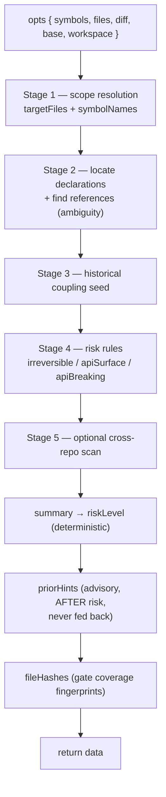
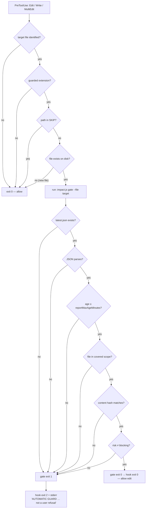

# 05 — The Analysis Pipeline (end to end)

> How **one** impact analysis actually runs, from the arguments you pass to the
> two artifacts it writes, then how the **PreToolUse gate** reads those
> artifacts to allow or refuse an edit, and finally how the **advisory memory
> layer** attaches past-incident context without ever touching the verdict.

This is a *procedure* document: it follows the code, in order, citing
`file:line`. For the *why* behind each signal see the companion docs linked
throughout and listed at the bottom.

---

## Table of contents

1. [The two entry points share one path](#1-the-two-entry-points-share-one-path)
2. [Inputs: symbols vs files vs `--diff`/`--base`](#2-inputs-symbols-vs-files-vs---diff--base)
3. [`run()` stage by stage](#3-run-stage-by-stage)
   - [Stage 1 — scope resolution](#stage-1--scope-resolution-libanalyzejs141168)
   - [Stage 2 — locate declarations + references](#stage-2--locate-declarations--find-references-libanalyzejs170207)
   - [Stage 3 — historical coupling seed](#stage-3--historical-coupling-seed-libanalyzejs209220)
   - [Stage 4 — risk rules](#stage-4--risk-rules-libanalyzejs222235)
   - [Stage 5 — optional cross-repo scan](#stage-5--optional-cross-repo-scan-libanalyzejs237238)
   - [Assembly: summary, risk, priorHints, fileHashes](#assembly--summary-risk-priorhints-filehashes-libanalyzejs240293)
4. [`persist()`: the two artifacts](#4-persist-the-two-artifacts-libanalyzejs301308)
5. [The gate procedure (PreToolUse)](#5-the-gate-procedure-pretooluse)
6. [Advisory memory](#6-advisory-memory)
7. [Worked example — the `Checkout` fixture](#7-worked-example--the-checkout-fixture)

---

## 1. The two entry points share one path

Whatever the transport — the CLI (`bin/impact.js`) or the `seismo-impact` MCP
server — the computation is the **same two calls**: `engine.run(opts)` then
`engine.persist(root, data)` (`lib/analyze.js:132`, `lib/analyze.js:301`).

- `run()` performs **no writes and no stdout** — it returns a plain `data`
  object (`lib/analyze.js:9`, `lib/analyze.js:269`).
- `persist()` materializes `.impact/report.md` + `.impact/latest.json`.

A single computation path and a single artifact are what guarantee the gate
always sees the report the analysis just wrote, regardless of who triggered it
(`lib/analyze.js:4-7`). See **01-architecture.md** for the transport topology.

### How a run gets triggered inside Claude Code

The user-facing entry points are five slash commands, all delegating to the
read-only `impact-analyst` subagent — three scoped developer views and two
decision/planning views over this same pipeline:

- `/seismo-cc:impact [symbol|file|--diff]` — the full impact scope.
- `/seismo-cc:tests [symbol|file|--diff]` — only the affected tests
  (`structural` + `historical`), the subset produced by Stage 4's
  `rules.affectedTests`; conceptually the MCP `get_affected_tests` query.
- `/seismo-cc:api-diff [--base <ref>]` — only the breaking public-surface
  changes vs a base, i.e. `apiBreaking` from `computeApiBreaking` (§3, Stage 4);
  conceptually the MCP `get_public_api_diff` query.
- `/seismo-cc:brief [symbol|file|--diff|<spec>]` — a decision view for analysts,
  PMs and leads: the agent translates the same assembled `data` into plain language
  (reuse-vs-net-new, complexity estimate, downstream, risk, and the decisions a
  human must make), no code. Handles a change or a not-yet-built spec.
- `/seismo-cc:scope [<spec>]` — scopes a not-yet-built feature: extracts the spec's
  concepts, searches the code for each (via the same `analyze`), and maps them to
  reusable anchors vs net-new pieces, with the decisions that block the work.

Both `brief` and `scope` deliberately size work by **reuse-vs-net-new**, not
developer-hours: the code may be written by an agent, so the cost driver is the
number of net-new subsystems and open decisions, not typing speed. On an empty
diff (a greenfield spec) they say so plainly instead of reporting a misleading
"small".

The MCP query tools `get_affected_tests` / `get_public_api_diff` compute those
same scoped answers **without** persisting, so they never overwrite the gate's
coverage. For the full "surfaces — when each is used" table, see
**01-architecture.md** §6.1.

---

## 2. Inputs: symbols vs files vs `--diff`/`--base`

`run(opts)` accepts `{ root, symbols, files, diff, base, workspace }`
(`lib/analyze.js:131`). `symbols` and `files` may each be an **array** (MCP
call) or a **comma-separated string** (CLI) — `toList()` normalizes both, so the
core is transport-agnostic (`lib/analyze.js:33-37`).

Two things are decided up front (`lib/analyze.js:138-139`):

| Derived | Rule |
|---|---|
| `mode` | `'diff'` if `opts.diff` is truthy, else `'plan'` |
| `base` | `opts.base` if given; otherwise `'origin/main'` **only in diff mode**, else `null` |

### How `targetFiles` and `symbolNames` are derived

```
targetFiles = toList(files)              # explicit files
symbolNames = toList(symbols)            # explicit symbols
if mode == diff:  targetFiles += git.changedFiles(root, base)   # union
targetFiles = scan.filterPaths(targetFiles, cfg)                # drop ignored / non-source
```

(`lib/analyze.js:142-148`). `changedFiles` gathers branch commits, index,
working tree **and** untracked files (`lib/git.js:33-46`). `filterPaths` is
essential: git returns paths that never went through `walk`, so without it
`.impact/report.md` would analyze itself (`lib/scan.js:439-446`).

**Declaration extraction when only files are given.** If you passed files but no
symbols, the pipeline reads each target file and extracts its declarations to
learn *what to search for* (`lib/analyze.js:152-168`):

- **Types first.** Only `kind === 'type'` names are taken initially. A property
  named `Status` mostly generates noise (`lib/analyze.js:161`).
- **Members only if room.** If there are already `>= 3` types, members are
  dropped entirely — the callers of a type already subsume the callers of its
  members (`lib/analyze.js:164`). Otherwise up to 6 member names of length `>= 6`
  are added.
- **The 12-symbol cap.** The final list is `[...types, ...members].slice(0, 12)`
  (`lib/analyze.js:167`). This bounds the O(symbols × files) resolution scan that
  runs inside a hook.

Declaration extraction is regex-based per language (`lib/scan.js:90-138`), with a
`NOISE` set filtering generic names like `Main`, `Index`, `Create`
(`lib/scan.js:142-146`).

---

## 3. `run()` stage by stage

The five numbered stages below map 1:1 to the numbered comments in `run()`.



### Stage 1 — scope resolution (`lib/analyze.js:141-168`)

Produces `targetFiles` and `symbolNames` exactly as described in §2.

### Stage 2 — locate declarations + find references (`lib/analyze.js:170-207`)

For each `name` in `symbolNames`:

1. **Collect ALL declaration sites, not just the first.** Every scanned file
   that textually contains the name is parsed; declarations whose name matches
   exactly are kept (`lib/analyze.js:181-188`). For each site the C# **namespace**
   is resolved via `scan.namespaceAt` (`lib/scan.js:159-167`).
2. **Ambiguity / homonym detection.** `ambiguous = declSites.length > 1`
   (`lib/analyze.js:193`). A name-based search cannot distinguish two `Order`
   classes in different namespaces; rather than present a falsely precise scope,
   the analysis records `declCount` and the distinct `namespaces` and flags it.
   .NET is the focus precisely because C# namespaces make clashes frequent
   (`lib/analyze.js:176-179`). The report then prints an explicit ambiguity
   warning (`lib/report.js:31-38`).
3. **Find references.** `scan.references(root, files, name, declFile, { ambiguous })`
   returns per-file hits, each carrying a `confidence` of `high | normal | low`
   derived from imports, same-module membership and qualified call sites
   (`->`, `::`, `.`, `new`) (`lib/scan.js:333-411`). When `ambiguous`, unqualified
   / non-importing sites are downgraded to `low`. The raw `count` (distinct
   lines) is unchanged so the risk score never regresses.
4. Only **external** references (file ≠ declaration file) feed `callSites` and
   `files`; every external hit is also pushed to `allCallers`
   (`lib/analyze.js:198-206`).

For the resolution model and confidence weighting see **03-mathematical-model.md**.

### Stage 2b — indirect (2-hop) impact (`lib/transitive.js`)

After the direct callers, one extra hop is computed (ROADMAP P3): the direct
caller files → the **types they declare** (the seeds) → the files that reference
those seed types. This surfaces second-order scope a change can ripple to without
those files ever naming the changed symbol. It is **report-only** — like the
advisory layers, it never enters `riskLevel` or the gate — labelled
`confidence: indirect`, bounded by the caps in `lib/transitive.js`, and disabled
when the `indirect` config flag is `false`. Not a transitive closure (that needs
a resolved graph, which is out of scope — see [ROADMAP.md](ROADMAP.md)).

### Stage 3 — historical coupling seed (`lib/analyze.js:209-220`)

The seed is the deduplicated set of `targetFiles` + each symbol's declaration
file (`lib/analyze.js:210-213`). If the repo is a git repo and the seed is
non-empty, `git.coupling` finds files that **co-change** with the seed across
history, filtered by `gitDepth`, `couplingMinCommits` and `couplingMinRatio`
(`lib/git.js:80-105`). This catches what static analysis cannot: reflection,
convention DI, hardcoded SQL, docs/config. See **07-git-historical-coupling.md**.

### Stage 4 — risk rules (`lib/analyze.js:222-235`)

`inspectFiles` = `targetFiles` + declaration files + the **top 15 coupled files**
(`lib/analyze.js:223-227`). The coupled files matter as much as the named scope:
it is often the endpoint that moves with the domain without being in the ticket.

Three rule families run over `inspectFiles`:

| Signal | Function | Notes |
|---|---|---|
| `irreversible` | `rules.irreversible(root, inspectFiles, diffTxt)` | scans **file content (after `stripNoise`) and the diff text**; a removed line counts as much as an added one for a `DROP COLUMN` (`lib/rules.js:10-50`) |
| `apiSurface` | `rules.apiSurface(root, inspectFiles)` | public surface that could break an outside consumer (`lib/rules.js:56-65`) |
| `apiBreaking` | `computeApiBreaking(root, base, targetFiles)` | **diff mode + base only**, else `[]` (`lib/analyze.js:234`) |
| `tests` | `rules.affectedTests(...)` | tests that reference a symbol or co-change with the scope (`lib/rules.js:96-113`) |

**`computeApiBreaking` in detail** (`lib/analyze.js:83-125`). For each changed
file it diffs the public surface **before vs after**: "before" is the file at the
merge-base (`git show mergeBase:file`), "after" is the current version
(`lib/git.js:51-62`). It compares on **RAW** content, not `stripNoise` — the
route string `"checkout"` *is* the endpoint's identity, so blanking it would
merge two distinct routes and hide a rename (`lib/analyze.js:92-96`). Surface
samples are grouped by rule id (endpoint vs endpoint, never endpoint vs
migration). A sample present *before* and absent *after* is `removed`; if a
same-keyed sample appears on the *added* side it is reclassified as `changed`
(a signature change) via `apiKey` = the last identifier of the match
(`lib/analyze.js:71-74`, `lib/analyze.js:109-122`). **Additions break no one and
are excluded by contract.** See **06-risk-model.md** for the breaking-change
taxonomy.

### Stage 5 — optional cross-repo scan (`lib/analyze.js:237-238`)

Only if `cfg.workspace` is set. `scanWorkspace` walks each **sibling** git repo
under the workspace (skipping self) and counts references to each symbol name
(`lib/analyze.js:44-66`). It is a deliberately capped **alert signal**, not a
cross-repo graph — v2 will replace it with a shared index.

### Assembly — summary, risk, priorHints, fileHashes (`lib/analyze.js:240-293`)

1. **`summary`** aggregates the counters: `callers`, `apiSurface`, `crossRepo`
   (distinct repos), `externalConsumers`, `irreversible`
   (`lib/analyze.js:240-246`).
2. **`risk = rules.riskLevel(cfg, summary)`** — deterministic, from the summary
   alone (`lib/analyze.js:247`; rule logic `lib/rules.js:120-154`). Levels:
   `low | moderate | high | blocking`. A weight-5 irreversible op, or a declared
   external consumer + modified public surface, escalates to **blocking**.
3. **`priorHints`** is computed **after** the risk and is **advisory only** —
   see §6. It is *never* fed back into the risk (`lib/analyze.js:249-252`).
4. **`fileHashes`** — SHA-1 of every file the gate will treat as "covered":
   `targetFiles` + declaration files + all callers + all coupled files
   (`lib/analyze.js:257-267`). Without these, a report that is *fresh* but based
   on an *earlier* version of a file would let a modification slip through blind
   (`lib/analyze.js:23-25`, `lib/analyze.js:256`).

The returned `data` also carries `mode`, `repo`, `branch`, `head`, `base`,
`generatedAt`, `configFound`, the full result arrays and `filesScanned`
(`lib/analyze.js:269-293`).

---

## 4. `persist()`: the two artifacts (`lib/analyze.js:301-308`)

`persist` writes **both** files into `.impact/`:

| Artifact | Renderer | Consumer | Why it exists |
|---|---|---|---|
| `report.md` | `report.render(data)` (`lib/report.js:5-181`) | humans + the reviewing agent | the readable scope: symbols, callers, coupling, public surface, breaking changes, irreversible ops, tests, blind spots |
| `latest.json` | `JSON.stringify(data, null, 2)` | the **gate** (`bin/impact.js:96`) | the machine record the PreToolUse hook parses — including `generatedAt`, `fileHashes`, `changedFiles`, `risk` |

Both are needed: the Markdown is for a person deciding whether to proceed; the
JSON is the source of truth the gate reads mechanically. Separating `run()` from
`persist()` lets a caller compute without writing (tests, dry-run), but **any
transport that wants to feed the gate MUST call `persist`** (`lib/analyze.js:298-300`).

The Markdown report deliberately ends with a **"Blind spots"** section
(`lib/report.js:168-178`): reflection, dynamic activation, hardcoded SQL,
DB-configured jobs, concatenated URLs, view-side bindings. The report reduces
upfront ignorance; it never replaces compiling then testing.

---

## 5. The gate procedure (PreToolUse)

The gate is the "the agent is *prevented*" half of the tool. Without it the
skill is a suggestion the agent ignores the moment it is in a hurry
(`hooks/impact-gate.js:6-8`).

### The hook wrapper (`hooks/impact-gate.js`)

The hook receives the tool call's JSON on **stdin** and short-circuits to
`exit 0` (allow) in these cases, in order:

1. No identifiable target file (`hooks/impact-gate.js:51`).
2. Extension not in `GUARDED` (`.cs .php .kt .kts .ts .tsx .sql .razor .cshtml`)
   — a gate that fires on a README is a gate the team turns off
   (`hooks/impact-gate.js:33`, `:52`).
3. Path matches `SKIP` — `.impact/`, build dirs, `Tests/`
   (`hooks/impact-gate.js:36`, `:53`).
4. **File does not yet exist** — creating a brand-new file breaks nothing
   upstream (`hooks/impact-gate.js:56`).

Otherwise it shells out to `impact.js gate --root <cwd> --file <target>`
(`hooks/impact-gate.js:58-62`).

### The gate command's ordered checks (`bin/impact.js:80-152`)

`gate` refuses (via the internal `fail()`, which is `exit 1`) at the **first**
failing check:

1. **`.impact/latest.json` exists?** else refuse — no analysis for this repo
   (`bin/impact.js:91-93`).
2. **JSON parses?** else refuse — report unreadable (`bin/impact.js:95-101`).
3. **Age `<= reportMaxAgeMinutes`?** `(now - generatedAt)/60000`; default limit
   120 min (`bin/impact.js:103-107`; `lib/config.js:26`).
4. **File in scope?** `rel` must be in the covered set
   (`changedFiles ∪ declFiles ∪ topCallers ∪ coupling`) (`bin/impact.js:109-120`).
5. **Hash matches?** the file must have a recorded `fileHashes[rel]`, and the
   current content's SHA-1 must equal it — otherwise the file changed since the
   analysis (or the report predates hashing) and a re-analysis is required
   (`bin/impact.js:122-142`). This is what stops "analyze once, then rewrite
   everything before the report expires".
6. **`risk.level !== 'blocking'`?** a blocking risk refuses and demands human
   validation (`bin/impact.js:145-148`).

All checks passed → `impact ok — risk <level>` on stdout, `exit 0`
(`bin/impact.js:150-151`).

### Exit codes and the "not a user refusal" message

- `gate` uses `exit 1` on refusal (`bin/impact.js:154-157`).
- The hook catches that and re-emits on **stderr** with **`exit 2`** — the
  Claude Code contract for "block the call, send stderr back to the model"
  (`hooks/impact-gate.js:11-16`, `:80`).
- The message is worded deliberately: a hook block is easily read as a *user*
  refusal, which makes the agent stop instead of fixing. So it states
  **"This is not a user refusal. Continue your work autonomously."** and lists
  the expected steps (`hooks/impact-gate.js:66-79`).



---

## 6. Advisory layers (memory + hidden-dependency checks)

Two layers share the same **advisory contract**: both are computed *after* the
risk verdict and are **never fed back** into it, so the gate stays deterministic.

### 6.0 Hidden-dependency checks (`lib/hidden.js`)

Cheap, build-free lexical scans (P1 in [ROADMAP.md](ROADMAP.md)) that shrink the
"Blind spots" list by *reporting* what the reference search cannot see, instead of
only listing it: the symbol name inside string literals (`reflection-string` —
reflection / DI / serialization / config), an entity's table name in SQL
(`sql-table` — hardcoded SQL), reflection / convention-DI constructs
(`dynamic-construct`), and routes built by concatenation (`route-concat`).
Computed at `lib/analyze.js` right after `priorHints`, returned as
`hiddenChecks[]`, rendered as the "Hidden-dependency checks" section
(`lib/report.js`). Each finding is a *possible* dependency, never proof, and it
does **not** enter `riskLevel` or the gate.

### 6.1 seismo-memory

`seismo-memory` (`lib/memory.js`) is an **optional, advisory** history layer.

### Determinism guarantee

`priorHints` is **context, never a decision**. It is computed *after* the risk
level (`lib/analyze.js:247` then `:252`) and is **never fed back** into
`riskLevel` or the gate. Same diff → same verdict, regardless of history
(`lib/memory.js:2-11`). The report prints prior incidents under an explicit
*"Advisory / informational only … does not affect the risk level above"* banner
(`lib/report.js:154-165`), and the short form tags them `(advisory)`
(`lib/report.js:196-197`).

### How hints are attached (`lib/memory.js:66-112`)

`priorHints(mem, symbols, files)` matches a stored incident to:

- a **symbol** if `incident.symbol === symbol.name`, or if `incident.file`
  equals the symbol's declaration file; then
- a **file** if `incident.file` is one of the target files and the incident was
  not already claimed by a symbol.

Each hint aggregates the count and the most recent incident (by ISO `at` date)
into a human sentence like *"3 past incident(s) on this symbol (last: TICKET-42)"*.

### How incidents get recorded

Recording happens **outside** the read-only analysis path — never by the
analysis subagent, so there is no loop with the gate (`lib/memory.js:114-119`):

- **Manual** — `impact record --file X --kind ... --ref TICKET-1`
  (`bin/impact.js:169-198`).
- **From reverts** — `impact record --from-reverts` mines recent `git revert`
  commits (whose body contains *"This reverts commit …"*, the most reliable
  incident signal) and records their files (`bin/impact.js:177-183`;
  `lib/git.js:175-194`; orchestrated by `recordFromReverts` at
  `lib/analyze.js:318-330`).
- **Git post-merge hook / CI** — `hooks/incident-record.js` calls the same
  `recordFromReverts`. It is **not** a Claude Code hook; it runs in ops/deploy,
  reads `SEISMO_ROOT` / `SEISMO_REVERT_DEPTH`, writes diagnostics to stderr only,
  and **always exits 0** so it can never break a merge or pipeline
  (`hooks/incident-record.js:20-33`).

### Idempotency and graceful degradation

- **Idempotent.** `recordMany` dedupes on `incidentKey` = `kind|ref|file|symbol`
  (`lib/memory.js:134-167`), so a replayed `--from-reverts` adds nothing new.
- **Graceful degradation.** If `cfg.memoryPath` is unset (the default,
  `lib/config.js:37`), `load` returns `{ incidents: [] }`, `priorHints` returns
  `[]`, and `record*` are no-ops — never an exception (`lib/memory.js:37-47`,
  `:120-132`). Memory is never a hard dependency; the core works offline.

---

## 7. Worked example — the `Checkout` fixture

Using the neutral sample domain built by `test/fixture.sh`: a `sample-service`
repo (`src/Domain/Checkout.cs`, `CheckoutManager.cs`,
`Api/Endpoints/CreateCheckoutEndpoint.cs`, `Infrastructure/CheckoutRepository.cs`,
`tests/Domain.Tests/CheckoutTests.cs`, a Laravel `PartnerController.php`) plus a
sibling `mobile-client` repo whose `src/CheckoutApi.kt` references `Checkout`.
History has 4 commits touching `Checkout.cs` + `CreateCheckoutEndpoint.cs` +
`CheckoutRepository.cs` **together**, and an *uncommitted* destructive migration
`Migrations/20260715_DropLegacyRef.cs`.

### Run A — `impact analyze --symbols Checkout --workspace <ws>` (plan mode)

| Stage | Output |
|---|---|
| **1. Scope** | `symbolNames = [Checkout]`, `targetFiles = []`, `mode = plan`, `base = null`. |
| **2. Locate + refs** | One declaration: `class Checkout` in `src/Domain/Checkout.cs` (`kind: type`, namespace `Sample.Domain`), so **not ambiguous** (`declCount = 1`). Word-boundary + lookbehind matching means `CheckoutManager`, `CheckoutStatus`, `CheckoutRepository`, `CreateCheckoutRequest` do **not** match. External callers: `CheckoutManager.cs` (return type + `CancelOrder(Checkout order)` = 2 lines) and `CheckoutTests.cs` (`new Checkout()` = 1 line). `callSites = 3`. |
| **3. Coupling** | Seed = `[src/Domain/Checkout.cs]`. Co-change: `CreateCheckoutEndpoint.cs` and `CheckoutRepository.cs` both at **5/5 commits = 100 %** (≥ `minCommits 3`, ≥ `minRatio 0.4`). `CheckoutManager.cs` (1/5) is filtered out — the point: coupling surfaces the raw-SQL repository that the name search never named. |
| **4. Risk rules** | `inspectFiles` adds the two coupled files. Irreversible: `AllowAnonymous` in the endpoint → **auth, weight 4**; `ExecuteSqlRaw` in the repository → **raw-sql, weight 3** (the `"DELETE FROM …"` literal is blanked by `stripNoise`, so `delete-bulk` does *not* fire — a nice illustration of why the SQL text is stripped but the call is not). Public surface: FastEndpoints endpoint + `CreateCheckoutRequest` contract → `apiSurface = 2`. `apiBreaking = []` (plan mode). Tests: `CheckoutTests.cs` (references `Checkout`). |
| **5. Cross-repo** | `mobile-client` references `Checkout` in `CheckoutApi.kt` → `crossRepo = 1` repo. |
| **Assembly** | `summary = { callers: 3, apiSurface: 2, crossRepo: 1, ... }`. `riskLevel`: worst irreversible weight 4 → **high** ("non-reversible side-effect operation detected"); + public-surface reason; + **consumer repo** reason. **Result: `risk = high`.** `priorHints = []` unless `memoryPath` is set. `fileHashes` covers `Checkout.cs`, `CheckoutManager.cs`, `CheckoutTests.cs`, `CreateCheckoutEndpoint.cs`, `CheckoutRepository.cs`. |

`persist` then writes `report.md` (with the ambiguity section absent, the
coupling table at 100 %, the public-surface list, the irreversible table, and
the cross-repo table) and `latest.json`.

### Run B — `impact analyze --diff` (escalation to BLOCKING)

In diff mode `changedFiles` picks up the **untracked** destructive migration
(`lib/git.js:43`). `rules.irreversible` matches `migrationBuilder.DropColumn`
→ **ef-destructive, weight 5**. `riskLevel` sees `worst >= 5` → **`blocking`**
("high-impact irreversible operation detected") (`lib/rules.js:125-126`).

### What the gate then does

If the agent tries to `Edit` `src/Infrastructure/Migrations/20260715_DropLegacyRef.cs`
after Run B, the gate passes checks 1–5 (report exists, fresh, file in scope,
hash matches) but **fails check 6** (`risk === 'blocking'`). `gate` exits 1, the
hook exits 2, and the model is told — explicitly *not a user refusal* — to
summarize the scope and ask for human validation before proceeding
(`bin/impact.js:145-148`, `hooks/impact-gate.js:66-79`).

---

## See also

- **01-architecture.md** — transports, the shared `run()`/`persist()` core, file layout.
- **03-mathematical-model.md** — reference resolution, confidence weighting, the counters.
- **06-risk-model.md** — risk levels, weights, the breaking-change taxonomy.
- **07-git-historical-coupling.md** — the co-change model behind Stage 3.
