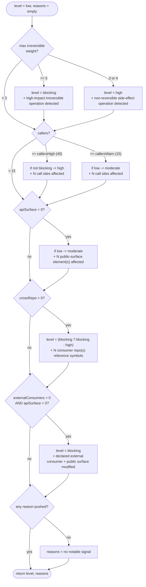

# 06 — The Risk Model

> **Abstract.** This document specifies, exactly and honestly, how `claude-impact`
> turns a bag of raw signals (irreversible operations, call-site counts, public
> surface, cross-repo hits, declared external consumers) into a single
> **risk level** drawn from a four-value lattice. The model is deliberately not
> an opaque numeric score: it is a **reconstructable ladder** where every
> escalation carries a human-readable reason, and where escalation is
> **monotone** — a level can only go up. Everything below is derived from the
> actual source: `lib/rules.js`, `lib/config.js`, `lib/analyze.js`, and
> `impact.config.example.json`. The exact rule weights are read from
> `config.js`, not guessed.

---

## Table of contents

1. [The four levels as a lattice](#1-the-four-levels-as-a-lattice)
2. [`riskLevel()` as a monotone maximum](#2-risklevel-as-a-monotone-maximum)
3. [Exact triggers and thresholds](#3-exact-triggers-and-thresholds)
4. [The IRREVERSIBLE rule catalogue](#4-the-irreversible-rule-catalogue)
5. [How irreversible matches are found](#5-how-irreversible-matches-are-found)
6. [API surface detection](#6-api-surface-detection)
7. [The `apiBreaking` before/after diff](#7-the-apibreaking-beforeafter-diff)
8. [`affectedTests`: structural + historical](#8-affectedtests-structural--historical)
9. [Escalation flowchart](#9-escalation-flowchart)
10. [Design rationale](#10-design-rationale)
11. [Cross-references](#11-cross-references)

---

## 1. The four levels as a lattice

The risk level is one of four ordered values:

$$\texttt{low} \;<\; \texttt{moderate} \;<\; \texttt{high} \;<\; \texttt{blocking}$$

They form a **total order** — a chain lattice of four elements. `low` is the
bottom (⊥, "no notable signal"), `blocking` is the top (⊤, the gate refuses the
edit). The whole computation lives in `riskLevel()` at
`lib/rules.js:120`.

Two structural properties matter:

- **Escalation is monotone.** Every branch in `riskLevel()` either leaves the
  level where it is or raises it. No branch ever lowers it. Concretely, once
  `level === 'blocking'`, no subsequent rule can pull it back down — each rule
  that touches an already-blocking state re-asserts `blocking` rather than
  overwriting it (see `lib/rules.js:130`, `:143`). **Once blocking, stays
  blocking.**
- **The order of evaluation does not change the result.** Because each rule only
  ever proposes a floor (a minimum level it demands), the final value is the
  *join* — the least upper bound — of all triggered demands. Reordering the
  `if` blocks would not change the answer. That is what "reconstructable in your
  head" means: you can compute the level yourself by taking the worst demand.

See [`03-mathematical-model.md`](./03-mathematical-model.md) for the formal
lattice/join framing; this document describes the concrete instantiation.

---

## 2. `riskLevel()` as a monotone maximum

Conceptually:

$$\mathrm{risk} \;=\; \max_{r \,\in\, \text{triggered rules}} \; \mathrm{demand}(r)$$

where `max` is taken over the lattice order of §1, and `demand(r)` is the
minimum level rule `r` insists on. If no rule triggers, the result is `low`
with the single reason `"no notable signal"` (`lib/rules.js:152`).

The function signature is `riskLevel(cfg, summary)` (`lib/rules.js:120`). It
reads exactly five fields off `summary` (built in `lib/analyze.js:240`):

| `summary` field       | Meaning                                                                 | Built at |
|-----------------------|-------------------------------------------------------------------------|----------|
| `irreversible`        | array of irreversible findings, each with a `weight`                    | `analyze.js:245` |
| `callers`             | total external call sites across all resolved symbols                   | `analyze.js:241` |
| `apiSurface`          | count of public-surface findings (`api.length`)                         | `analyze.js:242` |
| `crossRepo`           | number of **distinct** sibling repos that reference the symbols         | `analyze.js:243` |
| `externalConsumers`   | number of hand-declared external consumers from config                  | `analyze.js:244` |

The function returns `{ level, reasons }` — a value **and** its justification.
The `reasons[]` array is the audit trail: every escalation pushes the exact
string that caused it. This pairing (level + reasons) is the whole point of the
model and is consumed by the report and the gate — see
[`05-analysis-pipeline.md`](./05-analysis-pipeline.md).

---

## 3. Exact triggers and thresholds

Below is every branch of `riskLevel()`, in source order, with the exact
comparison and the exact `reasons[]` string it emits. Thresholds `t` come from
`cfg.thresholds` (`lib/config.js:21`, overridable per repo — see
[`08-configuration-reference.md`](./08-configuration-reference.md)); the default
values are `callersWarn: 15`, `callersHigh: 40`.

### 3.1 Irreversible operations (`lib/rules.js:125`)

`worst` is the **maximum weight** among all irreversible findings:
`summary.irreversible.reduce((a, f) => Math.max(a, f.weight), 0)`.

| Condition        | Level demanded | `reasons[]` string |
|------------------|----------------|--------------------|
| `worst >= 5`     | `blocking`     | `"high-impact irreversible operation detected"` |
| `worst >= 3` (and `< 5`) | `high` | `"non-reversible side-effect operation detected"` |
| `worst < 3`      | (no escalation from this branch) | — |

Note this is an `if / else if`: only one of the two fires, and it sets `level`
**directly** (not via a max) — but since it runs first from a `low` baseline,
that is equivalent to a floor. A weight of 1 or 2 (e.g. an outbound HTTP call,
weight 1) produces a *finding* but no escalation on its own.

### 3.2 Call sites (`lib/rules.js:129`)

`summary.callers` is the total number of external references to the changed
symbols.

| Condition                          | Effect on level | `reasons[]` string |
|------------------------------------|-----------------|--------------------|
| `callers >= t.callersHigh` (≥ 40)  | `if (level !== 'blocking') level = 'high'` | `` `${callers} call sites affected` `` |
| `callers >= t.callersWarn` (≥ 15)  | `if (level === 'low') level = 'moderate'` | `` `${callers} call sites affected` `` |

The high branch **cannot** demote an existing `blocking`. The warn branch only
lifts `low → moderate`; if the level is already `high` or `blocking`, the string
is still pushed (the reason is recorded) but the level is untouched. This is a
clean `if / else if`, so a caller count of 50 takes only the high branch.

### 3.3 Public surface (`lib/rules.js:137`)

| Condition             | Effect on level                | `reasons[]` string |
|-----------------------|--------------------------------|--------------------|
| `apiSurface > 0`      | `if (level === 'low') level = 'moderate'` | `` `${apiSurface} public-surface element(s) affected` `` |

Touching any public surface (an endpoint, a DTO, a hub…) guarantees **at least**
`moderate`. It never lowers a higher level.

### 3.4 Cross-repo consumers (`lib/rules.js:142`)

| Condition           | Effect on level                                   | `reasons[]` string |
|---------------------|---------------------------------------------------|--------------------|
| `crossRepo > 0`     | `level = level === 'blocking' ? 'blocking' : 'high'` | `` `${crossRepo} consumer repo(s) reference the modified symbols` `` |

A sibling repo in the configured `workspace` that references a modified symbol
forces **at least** `high` (and preserves `blocking` if already there). This is
the ternary that makes monotonicity explicit in the code.

### 3.5 Declared external consumers + public surface (`lib/rules.js:147`)

| Condition                                        | Effect on level | `reasons[]` string |
|--------------------------------------------------|-----------------|--------------------|
| `externalConsumers > 0` **AND** `apiSurface > 0` | `level = 'blocking'` | `"declared external consumer + public surface modified"` |

This is the strongest structural signal. If the operator has **hand-declared**
external consumers in `impact.config.json` (see the `externalConsumers` array in
`impact.config.example.json:14`) *and* this change touches any public surface,
the change is `blocking` outright. The reasoning: the tool's internal graph
cannot see consumers outside the repo, so the human declaration is treated as
ground truth. Note the **conjunction** — a declared consumer with no surface
change does not block by itself, and surface change with no declared consumer
does not block by itself (it only reaches `moderate` via §3.3).

### 3.6 The fallback

If no branch pushed a reason, `reasons` gets `"no notable signal"`
(`lib/rules.js:152`) and the level stays `low`.

---

## 4. The IRREVERSIBLE rule catalogue

These are read verbatim from `lib/config.js:42-55`. The `weight` is the entire
input to the §3.1 escalation — nothing else about an irreversible finding
affects the level. Weights range 1–5; **5** means "cannot be undone by a
rollback of the deploy" (schema loss, money moved), **1** means "worth naming
but not alarming on its own".

| Weight | `id`                  | Label                                                    | What it matches (regex intent) |
|:------:|-----------------------|----------------------------------------------------------|--------------------------------|
| **5**  | `ef-destructive`      | Destructive migration (Drop/Alter column or table)       | `migrationBuilder.DropColumn/Table/Index/ForeignKey`, `migrationBuilder.AlterColumn` |
| **5**  | `laravel-destructive` | Destructive Laravel migration                            | `->dropColumn`, `Schema::dropIfExists`, `->dropForeign` |
| **5**  | `payment`             | Payment / billing                                        | `Stripe`, `Mollie`, `PaymentIntent`, `Invoice(Service|Client)`, `Ogone`, `Worldline` |
| **4**  | `delete-bulk`         | Bulk delete                                              | `ExecuteDelete(`, `RemoveRange(`, `->truncate(`, `TRUNCATE TABLE`, `DELETE FROM` |
| **4**  | `auth`                | Authentication / authorization changed                   | `[Authorize`, `AllowAnonymous`, `AddAuthentication`, `JwtBearer`, `middleware('auth`, `Gate::`, `Policy` |
| **3**  | `ef-migration`        | EF Core migration                                        | `Migrations/…​.cs`, `class … : Migration`, `migrationBuilder.Drop/Alter/Rename` |
| **3**  | `laravel-migration`   | Laravel migration                                        | `database/migrations/`, `Schema::drop/dropIfExists/table` |
| **3**  | `raw-sql`             | Raw SQL executed                                         | `FromSqlRaw`, `ExecuteSqlRaw`, `ExecuteSqlInterpolated`, `DB::statement`, `DB::unprepared`, `new SqlCommand` |
| **3**  | `mail`                | Email sent                                               | `IEmailSender`, `MailMessage`, `SmtpClient`, `Mail::to/send/queue`, `SendGrid`, `Mailer->send` |
| **2**  | `job`                 | Background job enqueued (Hangfire / queue)               | `BackgroundJob.Enqueue/Schedule`, `RecurringJob.AddOrUpdate`, `dispatch(`, `->onQueue(`, `Bus::dispatch` |
| **2**  | `filesystem`          | Write or delete on disk / object storage                | `File.Delete`, `Directory.Delete`, `Storage::delete`, `MinioClient`, `S3Client`, `PutObject` |
| **1**  | `external-call`       | Outbound call to a third party                           | `HttpClient`, `Http::get/post/put/delete`, `WebClient`, `RestClient` |

**Escalation consequence, from the weights above:**

- Any weight-5 finding → the change is **`blocking`** (§3.1).
- The highest finding being weight 3 or 4 → **`high`**.
- Only weight 1–2 findings → **no escalation** from irreversibility; the finding
  is still listed in the report as context, but the level must come from
  callers / surface / consumers.

Because §3.1 uses `max` over weights, a change that is *both* a destructive
migration (5) and an outbound HTTP call (1) is driven entirely by the 5.

---

## 5. How irreversible matches are found

`irreversible(root, files, diff)` at `lib/rules.js:10` searches **three**
places for every rule, and de-duplicates:

1. **Path regex.** For each file `rel`, if `rule.re.test(rel)` matches the path
   itself, push a finding with `where = rel` and evidence `` `path: ${rel}` ``
   (`lib/rules.js:22-24`). This is how `ef-migration` / `laravel-migration` fire
   on a file simply *living* under `Migrations/` or `database/migrations/`.

2. **Stripped-content regex.** The file is read (`scan.read`) and passed through
   `scan.stripNoise` (`lib/scan.js:194`), which blanks comments and string
   *literals* (while preserving interpolation holes like `${x}` / `{x}`) so a
   rule keyword sitting inside a comment or a quoted string does **not** produce
   a false positive. The rule regex — recompiled case-insensitively via
   `new RegExp(rule.re.source, 'i')` — is executed against the cleaned content,
   and the matched text `m[0]` becomes the evidence (`lib/rules.js:25-32`).

3. **Diff `+`/`-` lines.** When a `diff` is supplied (diff mode), every line
   starting with a single `+` or `-` is scanned — but hunk headers (`+++` /
   `---`, matched by `/^[+-]{3}/`) are skipped (`lib/rules.js:38`). The evidence
   is the diff line itself, with `where = 'diff'`. The comment at
   `lib/rules.js:6-8` makes the intent explicit: **a *removed* line counts as
   much as an added one** — a `DROP COLUMN` deleted from a migration is as
   irreversible a signal as one added.

**Dedup** works on two levels:

- Within (1)+(2): a `seen` set keyed by `` `${rule.id}|${where}` `` prevents the
  same rule firing twice on the same file (`lib/rules.js:14-19`).
- For (3): before scanning the diff, `alreadyInFile` collects the ids already
  attributed to a concrete file; those rules are **skipped** in the diff pass
  (`lib/rules.js:36`, `:42`). The rationale (comment at `lib/rules.js:39-40`):
  three diff lines for the same `DropColumn` already tied to a file would make
  the report unreadable — the concrete file attribution wins.

Evidence is trimmed to 160 chars (`lib/rules.js:18`). The final list is sorted
by descending weight (`lib/rules.js:49`), so the report leads with the worst.

---

## 6. API surface detection

The **public surface** is "what breaks someone *outside* this repo" — the
internal reference graph cannot see those consumers, so surface is detected by
pattern. The rules live in `lib/config.js:58-65`:

| `id`             | Label                                       | Matches |
|------------------|---------------------------------------------|---------|
| `aspnet-attr`    | ASP.NET endpoint                            | `[HttpGet/Post/Put/Delete/Patch(...)]`, `[Route("...")]` |
| `fastendpoints`  | FastEndpoints endpoint                      | `: Endpoint<`, `: EndpointWithoutRequest<`, `Get/Post/Put/Delete("...")` |
| `minimal-api`    | Minimal API                                 | `app.MapGet/Post/Put/Delete/Patch(` |
| `laravel-route`  | Laravel route                               | `Route::get/post/put/patch/delete/apiResource/resource(` |
| `signalr`        | SignalR hub                                 | `: Hub`, `IHubContext<` |
| `contract`       | Public contract (DTO / Request / Response)  | `class …Request/Response/Dto/Contract/Command/Query`, `record …Request/Response/Dto` |

`apiSurface(root, files)` (`lib/rules.js:56`) reads each file, strips noise, and
delegates to `apiSurfaceOfContent(clean, rel)` (`lib/rules.js:73`). For each
rule it collects up to **12** matches (`.slice(0, 12)`, `lib/rules.js:77`), then
records a finding with:

- `samples`: the **deduplicated, trimmed** matched strings, capped at **6**
  (`[...new Set(...)].slice(0, 6)`, `lib/rules.js:83`) — these are shown in the
  report so a human can see *which* endpoints/DTOs;
- `count`: the number of matches found.

`apiSurfaceOfContent` is deliberately factored out of `apiSurface` so it can be
run against an **older version** of a file (from `git show base:file`), which is
exactly what the before/after diff needs (§7). The count of these findings is
what feeds `summary.apiSurface` and hence the §3.3 escalation.

---

## 7. The `apiBreaking` before/after diff

`computeApiBreaking(root, base, changedFiles)` (`lib/analyze.js:83`) answers a
sharper question than §6: *did this change break an existing consumer?* It runs
only in **diff mode with a base** (`lib/analyze.js:234`).

Mechanism:

1. Resolve the common ancestor: `mb = git.mergeBase(root, base)`. If there is no
   merge-base, return `[]` (`lib/analyze.js:84-85`).
2. For each changed file, compute the surface of the **current** version
   (`newRaw`) and the **base** version (`oldRaw = git.showFile(root, mb, rel)`).
3. **Crucially, this uses RAW content, not `stripNoise`** (`lib/analyze.js:92-96`).
   The route string `"checkout"` *is* the identity of an endpoint; blanking
   string literals would merge two distinct routes and hide a rename. The
   comment concedes this is "signal, not proof": the API_SURFACE regexes are
   specific enough that a stray match inside a comment is rare and
   inconsequential.
4. Group samples **by rule id** (endpoint vs endpoint, never endpoint vs
   migration), into `oldS` / `newS` sets per id (`lib/analyze.js:100-107`).
5. Compute per id:
   - `removed = oldS \ newS` (in base, gone now)
   - `added = newS \ oldS` (new now, absent in base)

   Then attempt to **pair a removal with an addition** under the same
   `apiKey(sample)` — the last identifier in the matched text
   (`lib/analyze.js:71-74`), a coarse proxy for the route/member name:
   - if a removed sample's key matches an added sample's key → emit
     `change: 'changed'` with `before` and `after` (a signature change on the
     same symbol) and consume the addition (`lib/analyze.js:113-117`);
   - otherwise → emit `change: 'removed'` with `before` only
     (`lib/analyze.js:118-119`).

**Additions are excluded by contract** (`lib/analyze.js:80-81`): a brand-new
endpoint breaks no existing consumer. Only `removed` and `changed` are reported.

### Honest limitations (stated in the code)

- **A signature change under the *same* route string is not detected.** Pairing
  keys on the last identifier means that if the route literal is unchanged and
  only, say, a parameter type changes elsewhere, the sample text may be
  identical and produce no `removed`/`added` pair — the regexes see the same
  surface string. This is the "signature-under-same-route not detected" gap.
- **A rename shows up as `removed`.** If the paired `apiKey` does not line up
  (e.g. the identifier itself changed), the old surface is reported as `removed`
  and the new one is silently dropped (additions excluded). A rename therefore
  reads as a pure removal — a deliberate false-positive-leaning choice: better to
  flag a break that turns out to be a rename than to miss a real removal.
- This diff is **advisory context in the report**; the escalation in §3 keys off
  `summary.apiSurface` (the *count* of surface findings), not off `apiBreaking`.

---

## 8. `affectedTests`: structural + historical

`affectedTests(cfg, refsBySymbol, couplingList)` (`lib/rules.js:96`) produces
the list of tests a reviewer should re-run, tagging each with a **confidence**:

| Confidence   | Source | Condition | Reason string |
|--------------|--------|-----------|---------------|
| `structural` | reference graph | a test file **references** one of the changed symbols (`scan.isTest` true) | `` `references ${symbol}` `` |
| `historical` | git co-change | a test file appears in the coupling list (co-changed with a seed file) | `` `co-changed ${pct}% with ${via}` `` |

Structural (`lib/rules.js:98-105`) walks `refsBySymbol` and keeps only files
that `scan.isTest(r.file, cfg)` recognises (path/name patterns from
`cfg.testPatterns`, `lib/scan.js:430`). Historical (`lib/rules.js:106-111`) adds
integration tests that **never name the symbol** but have historically changed
alongside it — these are exactly the ones a pure reference scan misses. The
`ratio` is rendered as a percentage. A test can accumulate multiple reasons; the
map is keyed by file, and its initial `confidence` is whichever branch inserted
it first. Coupling parameters (`couplingMinCommits`, `couplingMinRatio`) come
from config — see [`05-analysis-pipeline.md`](./05-analysis-pipeline.md) for the
git-history mechanics.

`affectedTests` is reporting output; it does not feed `riskLevel()`.

---

## 9. Escalation flowchart

The flowchart below is the escalation of `riskLevel()` exactly as coded
(`lib/rules.js:120-153`), evaluated top to bottom, each block only ever raising
the floor.

---

## 10. Design rationale

**A transparent, reconstructable ladder — not an opaque numeric score.** The
code comment at `lib/rules.js:115-119` states it plainly: *"an opaque score is
not actionable, and nobody trusts a number they cannot reconstruct in their
head."* A weighted-sum score like `0.37` gives a reviewer nothing to act on: it
cannot be argued with, cannot be traced to a cause, and drifts silently when a
weight is tuned. The four-level lattice with an explicit `reasons[]` array does
the opposite:

- **Every level has a cause you can point to.** The gate can say *"blocking
  because a declared external consumer is on a modified public surface"*, not
  *"blocking because 0.82 > 0.80"*.
- **The result is reproducible by hand.** Take the worst irreversible weight,
  compare the caller count to two thresholds, check three booleans — done. No
  hidden normalisation, no floating-point.
- **Monotonicity protects trust.** Because a level can only rise, adding a new
  detector can never *silently downgrade* a change that used to be flagged. New
  signal is strictly conservative.
- **Thresholds are honest knobs.** The two caller thresholds
  (`callersWarn`/`callersHigh`) are the only tunable numbers in the ladder, and
  the config comments (`lib/config.js:19-20`, `:24-27`) explicitly warn to
  calibrate them per repo — *"a gate that screams on every ticket is ignored
  within two weeks."*

**The deliberate absence of `--force`.** There is no flag anywhere in the model
or the gate to override a `blocking` verdict. This is intentional and it follows
from monotonicity: a ladder whose top can be bypassed on demand is not a ladder,
it is a suggestion. The escape hatch is not "force past the gate" — it is to
**change the inputs**: split the destructive migration into a reversible step,
declare/undeclare the external consumer honestly, or reduce the blast radius.
The model refuses to launder a risky change into an approved one via a
command-line flag; the only way down the lattice is to make the change actually
less risky. (Advisory history from `seismo-memory` is likewise **never** fed
back into the level — see `lib/config.js:33-37` and `impact.config.example.json:27`:
prior incidents annotate but never escalate, keeping the gate deterministic.)

---

## 11. Cross-references

- [`03-mathematical-model.md`](./03-mathematical-model.md) — the lattice / join
  formalism and why `max` is the right combinator.
- [`05-analysis-pipeline.md`](./05-analysis-pipeline.md) — how `summary` is
  assembled: symbol resolution, reference counting, git coupling, and where
  `riskLevel()` sits in `run()`.
- [`08-configuration-reference.md`](./08-configuration-reference.md) — every
  tunable: `thresholds`, `externalConsumers`, `workspace`, `memoryPath`, and the
  `impact.config.json` schema.
