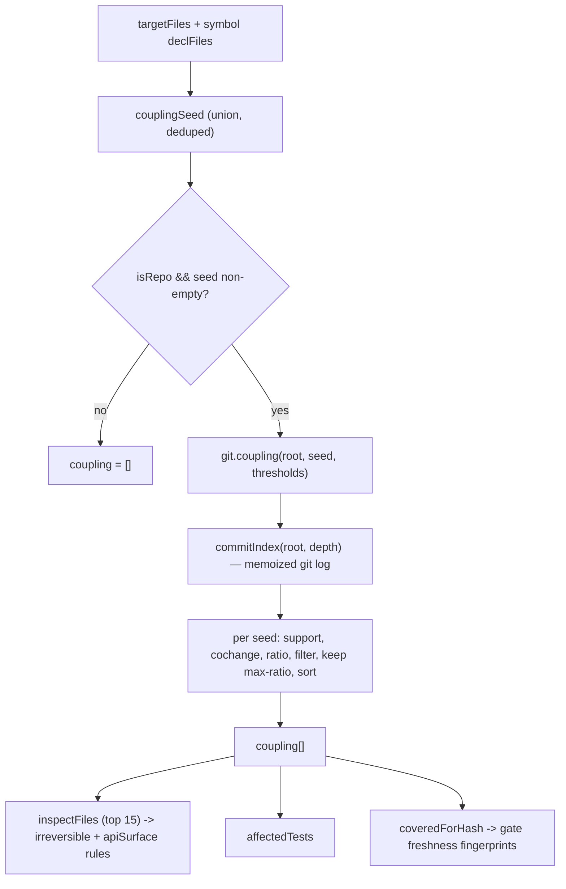

# 07 — Historical (Evolutionary) Coupling

> The strongest signal the tool produces, and the one no static analyzer can
> reproduce. This document is a deep dive into `lib/git.js` — the git wrapper and
> the co-change engine — and into how `lib/analyze.js` seeds and consumes it.

## Abstract

Static analysis answers *"who names this symbol?"*. It is blind to everything
that couples two files **without** a syntactic reference between them:
configuration stored in a database, hand-written SQL against a table, reflection
and convention-based dependency injection, a serialized contract mirrored in
another language, documentation that must move in lockstep with the code. The
tool recovers those relationships from the one place they are always recorded:
the version-control history. If two files have been *changed together* often
enough, they are coupled — regardless of whether one line of either mentions the
other.

This is the *mining-software-repositories* idea: a change set (a commit) is a
statement by a human that "these files belong to the same unit of work." We turn
that into an association rule with a confidence score, filter out the noise, and
present the surviving pairs as the co-change surface of the change under review.
The engine lives in `lib/git.js:80-147`; the seeding and consumption logic lives
in `lib/analyze.js:209-235`.

## Table of contents

1. [Motivation: what history sees that the parser cannot](#1-motivation-what-history-sees-that-the-parser-cannot)
2. [The formal signal: support, co-change, and confidence](#2-the-formal-signal-support-co-change-and-confidence)
3. [Windowing the history: the exact `git log` invocation](#3-windowing-the-history-the-exact-git-log-invocation)
4. [The duplicate-SHA problem and `parseLog`](#4-the-duplicate-sha-problem-and-parselog)
5. [Filtering thresholds: `couplingMinCommits` and `couplingMinRatio`](#5-filtering-thresholds-couplingmincommits-and-couplingminratio)
6. [The algorithm and its complexity](#6-the-algorithm-and-its-complexity)
7. [How `analyze.js` seeds and consumes coupling](#7-how-analyzejs-seeds-and-consumes-coupling)
8. [`churn` and `lastAuthors`: prudence and notification](#8-churn-and-lastauthors-prudence-and-notification)
9. [A worked micro-example](#9-a-worked-micro-example)
10. [Honest limits](#10-honest-limits)

See also: [`02-scientific-concepts.md`](./02-scientific-concepts.md) for the
conceptual grounding, [`03-mathematical-model.md`](./03-mathematical-model.md)
for the probabilistic framing shared across signals, and
[`04-algorithms-and-complexity.md`](./04-algorithms-and-complexity.md) for the
end-to-end complexity budget.

---

## 1. Motivation: what history sees that the parser cannot

The header comment on `coupling()` states the thesis directly
(`lib/git.js:74-79`):

> Co-change coupling: which files change HISTORICALLY together with the target.
> It's the most useful signal of the bunch, because it's language-agnostic and
> catches precisely what static analysis doesn't see: config in the database,
> hardcoded SQL, reflection, convention-based DI, docs to update.

Every item in that list is a real coupling that leaves **no syntactic trace** in
the source of the file you are editing:

- **Configuration in a database / config files.** A feature flag or a lookup
  table row governs a code path. Renaming the enum member has no compiler
  consequence, but a row somewhere must change too. The parser sees nothing; the
  history has been editing the migration and the enum in the same breath for a
  year.
- **Hardcoded SQL.** A repository issues `DELETE FROM Checkouts WHERE ...` as a
  raw string. There is no reference from `Checkout.cs` to that repository, and
  no reference back. Rename the table and the SQL silently rots. This is exactly
  the trap the fixture is built around (`test/fixture.sh`, the
  `CheckoutRepository.cs` "no named call in the signature — only historical
  coupling will surface it" comment).
- **Reflection and convention-based DI.** `services.AddScoped<IFoo, Foo>()` or a
  reflective handler-dispatch resolves types by name at runtime. Static
  reference search cannot follow the indirection; history can.
- **Serialized contracts across languages.** A C# `record` and its Kotlin or
  TypeScript mirror share no symbol table, yet they move together.
- **Documentation.** A README, an OpenAPI spec, an ADR that is updated whenever
  a given handler changes. Pure text, invisible to any type-aware tool.

Conceptually this is the **evolutionary / logical coupling** studied in the
mining-software-repositories literature — the observation, due to Gall et al.
(logical coupling from release history) and later formalized with association
rules over change sets by Zimmermann et al., that files which change together
are coupled in a way orthogonal to, and often stronger than, syntactic
dependency. We do not cite specific results here; the point is that the *idea* —
co-change as a first-class coupling signal — is well established, and the engine
below is a deliberately small, transparent implementation of it.

The critical property is that this signal is **language-agnostic**: `coupling()`
never parses a file. It only looks at which paths appear in which commits. A
`.sql` file, a `.md` file, a `.razor` view, and a `.cs` handler are all just
strings in a change set.

---

## 2. The formal signal: support, co-change, and confidence

Fix the analysis window to the last `depth` commits (see §3). Let a commit $c$
be identified with the **set of files it touches**, $\mathrm{files}(c)$. For a
file $A$ define:

$$
\mathrm{support}(A) \;=\; \left|\lbrace \, c : A \in \mathrm{files}(c) \,\rbrace \right|
$$

the number of commits in the window that touched $A$. In code this is
`touching` (`lib/git.js:87`):

```js
const touching = commits.filter(c => c.files.includes(f));
```

For an ordered pair $(A, B)$ define the **co-change count**:

$$
\mathrm{cochange}(A, B) \;=\; \left|\lbrace \, c : A \in \mathrm{files}(c)\ \wedge\ B \in \mathrm{files}(c) \,\rbrace \right|
$$

the number of commits that touched **both**. This is the counter accumulated in
`counts` (`lib/git.js:89-95`): for every commit touching $A$, increment a
tally for each *other* file in that commit.

The reported strength is the **ratio**, i.e. the confidence of the association
rule $A \Rightarrow B$:

$$
r(A \to B) \;=\; \frac{\mathrm{cochange}(A, B)}{\mathrm{support}(A)}
\;=\; \widehat{P}\left(B \in c \;\mid\; A \in c\right).
$$

It reads as: *"among the commits that touched $A$, what fraction also touched
$B$?"* — an empirical estimate of the conditional probability that editing $A$
drags $B$ along. In code (`lib/git.js:97`):

```js
const ratio = n / touching.length;   // n = cochange(f, other), touching.length = support(f)
```

### Asymmetry

The ratio is **directional**. In general

$$
r(A \to B) \;\ne\; r(B \to A),
$$

because the denominators differ ($\mathrm{support}(A)$ vs
$\mathrm{support}(B)$) even though the numerator $\mathrm{cochange}$ is
symmetric. Concretely: a widely-edited hub file $B$ (say a DI registration or a
central config) will be dragged in by almost every edit to a small satellite
$A$, giving $r(A \to B) \approx 1$; but editing the hub $B$ pulls in $A$ only
rarely, so $r(B \to A)$ is small. The engine always computes the ratio **from
the seed file's point of view** ($f$ is the seed, `other` is the candidate), so
the number you read in a report is "given I touch the seed, how often does this
other file come along" — which is exactly the question a reviewer asks. This
asymmetry is the reason confidence, not a symmetric measure like the Jaccard
index, is the right primitive here; see
[`03-mathematical-model.md`](./03-mathematical-model.md).

---

## 3. Windowing the history: the exact `git log` invocation

The whole engine runs off a single log command, built once per `(root, depth)`
and memoized (`lib/git.js:115-122`):

```js
function commitIndex(root, depth) {
  const key = `${root}|${depth}`;
  if (_indexCache.has(key)) return _indexCache.get(key);
  const log = git(root, ['log', `-n${depth}`, '--format=%H', '--name-only', '--no-renames', '-m', '--first-parent']);
  const commits = parseLog(log);
  _indexCache.set(key, commits);
  return commits;
}
```

Each flag is load-bearing:

- **`-n${depth}`** — bound the window to `depth` commits. The default is
  `gitDepth = 400` (`lib/config.js:18`). A window keeps the analysis fast and
  keeps *recent* coupling from being diluted by ancient history that no longer
  reflects how the code is organized. It is a deliberate recency bias.
- **`--format=%H`** — emit only the 40-hex commit SHA as the header line for
  each commit. No author, date, or subject in the index path (those are fetched
  separately by `churn` / `lastAuthors`).
- **`--name-only`** — list the touched paths, one per line, under each commit.
  This is the entire payload we need. Crucially, the log is run **without a
  pathspec** — the comment at `lib/git.js:82-84` explains why: with a pathspec,
  `--name-only` would list only the matching files, which would make any
  coupling invisible (you would never see the *other* files that co-changed).
- **`--no-renames`** — treat a rename as a delete + add of two distinct paths
  rather than collapsing it. We are matching on the path strings the rest of the
  tool uses (the current working-tree paths), so a rename should *not* silently
  unify the old and new names.
- **`--first-parent`** — follow only the first parent of each merge, i.e. walk
  the mainline and treat a merged feature branch as a single step rather than
  interleaving all of its internal commits. This keeps the window's "commits"
  aligned with logical units of integration.
- **`-m`** — **show diffs/file-lists for merge commits.** This is the subtle
  one. Without `-m`, a merge commit produces **no** `--name-only` output at all
  (git suppresses per-file listing for merges by default). On a workflow where
  features land through merge commits, that means the merge — often the commit
  that actually carries the feature's file set on the mainline — would appear
  **empty**, and the coupling on feature branches would simply vanish. The
  comment at `lib/git.js:111-113` states this plainly: *"`-m` makes merges
  appear, otherwise merge commits are empty and the coupling on feature branches
  disappears."*

`-m` and `--first-parent` together are what create the duplicate-SHA problem
that `parseLog` must then repair — the subject of the next section.

---

## 4. The duplicate-SHA problem and `parseLog`

`-m` has a side effect: it makes a merge commit appear **once per parent**. The
same 40-hex SHA therefore recurs several times in the log output, each occurrence
carrying an overlapping (diff-against-that-parent) file list. If we naively
treated each occurrence as a separate commit, both `support` (the size of
`touching`) and the `cochange` counters would be **inflated** on merge-heavy
histories — the exact denominators and numerators of §2 would be wrong. The
comment at `lib/git.js:124-127` calls this out.

`parseLog` (`lib/git.js:128-147`) fixes it with two levels of deduplication:

```js
function parseLog(log) {
  const bySha = new Map();
  let cur = null;
  for (const line of log.split('\n')) {
    const t = line.trim();
    if (/^[0-9a-f]{40}$/.test(t)) {
      if (bySha.has(t)) {
        cur = bySha.get(t);            // same SHA seen again -> merge into it
      } else {
        cur = { sha: t, files: [], _seen: new Set() };
        bySha.set(t, cur);
      }
    } else if (t && cur) {
      if (!cur._seen.has(t)) { cur._seen.add(t); cur.files.push(t); }  // dedupe files
    }
  }
  const commits = [...bySha.values()];
  for (const c of commits) delete c._seen;
  return commits;
}
```

- **Dedup by SHA** — a `Map` keyed on the SHA. A repeated SHA header does not
  create a new commit object; it reselects the existing one, so all the file
  lists from all parents accumulate into a *single* commit entry. Each real
  commit is therefore counted exactly once in `support` and `cochange`.
- **Dedup by file** — a per-commit `_seen` set guards `files.push`, so a path
  that appears against multiple parents is recorded once. Without it,
  `c.files.includes(f)` would still be true but the inner `counts` loop
  (`lib/git.js:90-95`) would double-count `other` files within one commit.

The `_seen` set is a private scratch field, deleted before the commits are
returned so it never leaks into the cached index.

The output is a clean array `[{ sha, files: [...] }, ...]`, one entry per real
commit, with a deduplicated file list — the exact shape the set-theoretic
definitions in §2 assume.

---

## 5. Filtering thresholds: `couplingMinCommits` and `couplingMinRatio`

Two thresholds separate signal from noise. Defaults live in
`lib/config.js:24-25`:

```js
couplingMinCommits: 3,   // ignore statistical noise
couplingMinRatio: 0.4,   // co-changed in >=40% of commits touching the target
```

They are applied at two points in `coupling()`:

1. **On the seed** (`lib/git.js:88`): if a file was touched by fewer than
   `minCommits` commits in the window, it is skipped entirely as a seed —
   `if (touching.length < minCommits) continue;`. A file with support of 1 or 2
   has no statistically meaningful co-change distribution; any ratio computed
   from it (1/1, 1/2, 2/2) is an artifact of a tiny denominator, not evidence.

2. **On each candidate pair** (`lib/git.js:98`):
   `if (n < minCommits || ratio < minRatio) continue;`. A candidate must have
   been co-changed **at least `minCommits` times** *and* reach a ratio of **at
   least `minRatio`**. The count floor kills pairs that only ever coincided once
   or twice; the ratio floor kills pairs that coincide often only because one of
   them is a hub touched by almost everything (low confidence despite a high raw
   count).

The consequence is intentional and worth stating explicitly: **a new repository,
or any file with fewer than 3 commits of history, yields empty coupling.** This
is not a bug or a degenerate edge case to paper over — it is the honest output.
Below the thresholds there is *no signal*, only noise, and the tool declines to
manufacture confidence it does not have. Evolutionary coupling is a claim about
repeated behavior over time; without repetition there is nothing to claim.

The thresholds are tunable per repo via `impact.config.json`
(`lib/config.js:79` merges user overrides), and the config comment warns that a
gate which screams on every ticket is ignored within two weeks
(`lib/config.js:19-20`). The right values are the ones you find *after* measuring
on your own history.

---

## 6. The algorithm and its complexity

The full engine (`lib/git.js:80-105`):

```js
function coupling(root, files, opts) {
  const { depth = 400, minCommits = 3, minRatio = 0.4 } = opts || {};
  const result = new Map();
  const commits = commitIndex(root, depth);          // built once, memoized
  for (const f of files) {                            // for each seed file
    const touching = commits.filter(c => c.files.includes(f));
    if (touching.length < minCommits) continue;       // seed threshold
    const counts = new Map();
    for (const c of touching) {
      for (const other of c.files) {
        if (other === f) continue;
        counts.set(other, (counts.get(other) || 0) + 1);   // cochange tally
      }
    }
    for (const [other, n] of counts) {
      const ratio = n / touching.length;
      if (n < minCommits || ratio < minRatio) continue;     // pair threshold
      const prev = result.get(other);
      const entry = { file: other, commits: n, of: touching.length, ratio, via: f };
      if (!prev || prev.ratio < ratio) result.set(other, entry);   // keep max-ratio
    }
  }
  return [...result.values()].sort((a, b) => b.ratio - a.ratio || b.commits - a.commits);
}
```

Step by step:

1. **Build the commit index once.** `commitIndex(root, depth)` is memoized in
   the module-level `_indexCache` (`lib/git.js:107, 116-121`), so the whole
   `git log` + parse happens a single time per `(root, depth)` — important
   because the cross-repo scan can call `coupling` once per repo, and within one
   analysis every seed shares the same index.
2. **Per seed `f`, compute `touching`** = the commits that touched `f`. Apply the
   seed threshold.
3. **Tally co-occurrences.** For every commit in `touching`, increment `counts`
   for each *other* file. After the loop, `counts.get(other)` is exactly
   $\mathrm{cochange}(f, \mathrm{other})$.
4. **Keep the max-ratio entry per other-file.** `result` is keyed on the
   *candidate* file, not the pair. A candidate reachable from several seeds is
   stored with its **highest** ratio (`if (!prev || prev.ratio < ratio)`), and
   the winning seed is recorded in `via`. This deduplicates the report so a
   coupled file appears once, at its strongest.
5. **Sort by ratio, then by commit count** as a tie-breaker
   (`b.ratio - a.ratio || b.commits - a.commits`). Confidence first; among equal
   confidence, more evidence (more co-change commits) ranks higher.

### Complexity

Let $C$ be the number of commits in the window ($\le \mathrm{depth}$), $S$ the
number of seed files, and $\bar{m}$ the average number of files per commit.

- Building the index: one `git log`, parsed in $O(C \cdot \bar{m})$.
- `touching` for one seed: `commits.filter(c => c.files.includes(f))` is
  $O(C \cdot \bar{m})$ (a linear `includes` per commit).
- The tally loop over `touching`: $O(C \cdot \bar{m})$.

So the per-seed cost is $O(C \cdot \bar{m})$ and the whole engine is

$$
O\!\left(C \cdot \bar{m} \cdot S\right),
$$

i.e. linear in **commits × files-per-commit × seeds**. There is no pairwise blowup
over the file universe: work is proportional to the history actually walked, and
the window (`depth`) is the knob that bounds $C$. See
[`04-algorithms-and-complexity.md`](./04-algorithms-and-complexity.md) for how
this fits the overall analysis budget.

---

## 7. How `analyze.js` seeds and consumes coupling

**Seeding** (`lib/analyze.js:209-220`). The seed set is the union of the target
files and the declaration files of the located symbols:

```js
const couplingSeed = [...new Set([
  ...targetFiles,
  ...symbols.map(s => s.declFile).filter(Boolean),
])];
const coupling = git.isRepo(root) && couplingSeed.length
  ? git.coupling(root, couplingSeed, {
      depth: cfg.gitDepth,
      minCommits: cfg.thresholds.couplingMinCommits,
      minRatio: cfg.thresholds.couplingMinRatio,
    })
  : [];
```

Two guards matter: `git.isRepo(root)` (no history outside a repo → empty
coupling, graceful degradation) and `couplingSeed.length` (nothing to seed →
skip). Thresholds are pulled straight from config, so a repo can retune them
without touching code.

**Consumption.** The coupling result then feeds three downstream steps:

1. **Rule inspection scope** (`lib/analyze.js:223-227`). The top 15 coupled files
   are folded into `inspectFiles` alongside the target and declaration files:

   ```js
   const inspectFiles = [...new Set([
     ...targetFiles,
     ...symbols.map(s => s.declFile).filter(Boolean),
     ...coupling.slice(0, 15).map(c => c.file),
   ])];
   ```

   This is where the signal pays off: the raw-SQL repository or the endpoint that
   nobody named in the ticket gets pulled into the irreversible-operation and
   public-surface checks *because history said it travels with the change*. The
   comment at `lib/analyze.js:230-231` notes that the public surface of the
   coupled files "is often the endpoint that changes with the domain without
   being named in the ticket."

2. **Affected tests** (`lib/analyze.js:235`): `rules.affectedTests(cfg,
   refsBySymbol, coupling)` uses coupling to suggest tests to run.

3. **Coverage fingerprints** (`lib/analyze.js:257-267`): every coupled file is
   added to `coveredForHash`, so the PreToolUse gate records a content
   fingerprint for it. If a coupled file later changes, the report is considered
   stale and re-analysis is forced — the coupling surface is part of what the
   report *covers*.

Coupling is also emitted verbatim in the returned `data.coupling`
(`lib/analyze.js:280`) for the report renderer.



---

## 8. `churn` and `lastAuthors`: prudence and notification

Two smaller history helpers round out the picture. They inform **prudence** and
**who to notify** — deliberately *not* risk scoring or blame.

**`churn`** (`lib/git.js:149-156`):

```js
function churn(root, file, depth = 400) {
  const out = git(root, ['log', `-n${depth}`, '--format=%H', '--', file]);
  return out.split('\n').filter(Boolean).length;
}
```

Churn is the number of commits touching a file in the window — i.e.
$\mathrm{support}(\mathrm{file})$ computed directly with a pathspec (here a
pathspec *is* wanted, since we only need the count for one file). The header
comment frames the intent: *"A highly unstable file deserves more caution than
one that's been frozen for two years"* (`lib/git.js:150-152`). High churn is a
prudence flag — a file many hands keep reworking is more likely to hide implicit
contracts — not a penalty.

**`lastAuthors`** (`lib/git.js:158-165`):

```js
function lastAuthors(root, file, n = 3) {
  const out = git(root, ['log', `-n${n}`, '--format=%an', '--', file]);
  return [...new Set(out.split('\n').map(s => s.trim()).filter(Boolean))];
}
```

The most recent distinct authors of a file. The header is explicit that this is
*"useful for knowing who to warn, not for assigning blame"*
(`lib/git.js:159-161`). If your change disturbs a coupled file, these are the
people who last understood it and should be looped into review — a
notification/reviewer-suggestion signal, nothing more.

Both are intentionally kept out of the deterministic risk computation; they are
advisory context layered on top of the coupling surface.

---

## 9. A worked micro-example

We use the tool's own test fixture (`test/fixture.sh`), which builds a synthetic
repo with neutral file names. The relevant history of the `sample-service` repo:

- **Commit 0** (`init: domain, endpoint, repository, tests`) touches everything:
  `src/Domain/Checkout.cs`, `src/Domain/CheckoutManager.cs`,
  `src/Api/Endpoints/CreateCheckoutEndpoint.cs`,
  `src/Infrastructure/CheckoutRepository.cs`,
  `tests/Domain.Tests/CheckoutTests.cs`,
  `app/Http/Controllers/PartnerController.php`, `.gitignore`.
- **Commits 1–4** (`feat: revision i`) each append a line to exactly three
  files: `Checkout.cs`, `CreateCheckoutEndpoint.cs`, `CheckoutRepository.cs`.

Tabulating which commit touched which file (✓ = touched):

| Commit | Checkout.cs | CreateCheckoutEndpoint.cs | CheckoutRepository.cs | CheckoutManager.cs | CheckoutTests.cs | PartnerController.php |
|--------|:-:|:-:|:-:|:-:|:-:|:-:|
| 0 init | ✓ | ✓ | ✓ | ✓ | ✓ | ✓ |
| 1      | ✓ | ✓ | ✓ |   |   |   |
| 2      | ✓ | ✓ | ✓ |   |   |   |
| 3      | ✓ | ✓ | ✓ |   |   |   |
| 4      | ✓ | ✓ | ✓ |   |   |   |

Take the seed $A = \texttt{src/Domain/Checkout.cs}$.

$$
\mathrm{support}(A) = 5 \quad(\text{commits } 0,1,2,3,4).
$$

Co-change counts and ratios from $A$:

| Candidate $B$ | $\mathrm{cochange}(A,B)$ | $r(A \to B) = \mathrm{cochange}/5$ | Passes `minCommits=3` & `minRatio=0.4`? |
|---|:-:|:-:|:-:|
| `CreateCheckoutEndpoint.cs` | 5 | $5/5 = 1.00$ | ✓ kept |
| `CheckoutRepository.cs`     | 5 | $5/5 = 1.00$ | ✓ kept |
| `CheckoutManager.cs`        | 1 | $1/5 = 0.20$ | ✗ (count < 3, ratio < 0.4) |
| `CheckoutTests.cs`          | 1 | $1/5 = 0.20$ | ✗ |
| `PartnerController.php`      | 1 | $1/5 = 0.20$ | ✗ |
| `.gitignore`                | 1 | $1/5 = 0.20$ | ✗ (also filtered as non-source upstream) |

So the coupling reported for `Checkout.cs` is:

```
CreateCheckoutEndpoint.cs   commits 5/5   ratio 1.00
CheckoutRepository.cs       commits 5/5   ratio 1.00
```

The punchline is `CheckoutRepository.cs`. Its `Purge` method issues
`ExecuteSqlRaw("DELETE FROM Checkouts WHERE CustomerCode = '" + code + "'")`
— a raw SQL string against the `Checkouts` table with **no named reference** to
the `Checkout` class in its signature. A reference-based analyzer editing
`Checkout` would never surface it. History surfaces it at ratio $1.00$, and
because it lands in the top-15 `inspectFiles` (§7) it then trips the `raw-SQL`
and `delete-bulk` irreversible rules (`lib/config.js:47-48`). That is the entire
value proposition of the signal in one file.

Note also the **asymmetry** in action, if you instead seeded on the hub commit-0
files: `CheckoutManager.cs` has $\mathrm{support} = 1$, so it is skipped as a
seed outright (below `minCommits`), and it never appears as a candidate either
(co-changed only once). Support and confidence together keep the once-off
coincidences of the init commit out of the report.

---

## 10. Honest limits

The signal is powerful but empirical, and the code is candid about it. The
honest caveats:

- **It needs history.** No commits, no coupling. A greenfield repo, a
  freshly-split module, or a file with fewer than `minCommits` commits produces
  an empty result *by design* (§5). The tool says "I don't know" rather than
  guessing.
- **Co-committed ≠ coupled.** A commit is a human's assertion of "one unit of
  work," but humans batch unrelated fixes into one commit, run repo-wide
  formatters, bump a version across many files, or land a giant mechanical
  refactor. Any of these can co-commit files that are not logically coupled,
  producing a **spurious** high ratio. The thresholds reduce this (a one-off
  batch needs to recur ≥3 times to survive) but cannot eliminate it. `churn` and
  the `--first-parent`/`-m` windowing help, but a reviewer must still read the
  reported pairs with judgment.
- **The ratio is an estimate on a finite window.** $r(A \to B)$ is a maximum-
  likelihood estimate of a conditional probability from at most `depth` commits.
  With a small denominator it is high-variance: $2/3 = 0.67$ and $20/30 = 0.67$
  read identically but carry very different evidential weight. This is precisely
  why the report sorts by ratio **then by commit count** (§6) and why the raw
  `commits`/`of` counts are surfaced alongside the ratio — so a human can weigh
  the sample size, not just the point estimate. See
  [`03-mathematical-model.md`](./03-mathematical-model.md) for the broader
  discussion of estimation under a finite window.
- **Recency bias is a choice.** The `depth = 400` window deliberately forgets
  older structure. That is usually right (it tracks how the code is organized
  *now*), but a coupling that was real and will re-emerge can fall out of the
  window in a very active repo.

None of these are fatal; they are the reasons the coupling surface is presented
as **evidence for a reviewer**, ranked and quantified, rather than as a verdict.
It is the strongest signal the tool has precisely because it sees what the
parser cannot — and it is honest about the fact that it is a statistical claim,
not a proof.

## 11. Validation

Because coupling is the tool's strongest claim, it is the one that gets measured
(ROADMAP P2). The harness treats git history as its own ground truth using the
standard transaction-based method from the Mining Software Repositories
literature (Zimmermann et al.):

1. Each commit is a **transaction** — a set of files that changed together.
2. For an evaluation commit, pick one file as the query **seed**, and predict the
   rest with `couplingFrom` built from **prior commits only**
   (`commits.slice(i+1)`; the log is newest-first, so this is strictly older
   history — no leakage; the scored commit is never in its own training set).
3. Compare the predicted set to what actually co-changed in that commit and
   accumulate true/false positives and false negatives (micro-averaged).

The engine is `lib/validate.js` (`evaluateAt` for one threshold pair,
`evaluateCoupling` for the full sweep); the runner is `test/validate.js`:

```bash
node test/validate.js ~/repos/my-service --window 800
```

It prints precision/recall/F1 across the grid `couplingMinCommits` ×
`couplingMinRatio` and marks the best F1, so a repo's thresholds can be tuned
from data rather than intuition. Extracting the pure `couplingFrom` from
`coupling` ([`lib/git.js`](../lib/git.js)) is what makes this leakage-free split
possible.

**Honest caveats (built into the method):**

- It scores the **coupling signal only** — the language-agnostic core. The static
  fan-in signal needs a resolved-symbol oracle and is out of scope until
  [ROADMAP P4](./ROADMAP.md). Do not read these numbers as the tool's overall
  accuracy.
- **Recall is a conservative lower bound.** A file that never co-changed with the
  seed before is unpredictable by *any* co-change model, yet still counts as a
  miss. Co-change is meant to catch stable, repeated pairings — not first-time
  ones.
- **Mega-commits are excluded** (`maxCommitFiles`, default 25): mass renames and
  reformats are not logical transactions and would dominate the counts.
- Only commits with enough prior history are scored (`minPriorCommits`, default
  30); a young repo is reported as "too little history to validate" rather than
  scored on noise.

`git revert` commits (`recentReverts`, already used by
`impact record --from-reverts`) are available as a weak incident oracle for a
future risk-precision check; a richer labelled incident set gates the learned
risk layer (ROADMAP "Later").
